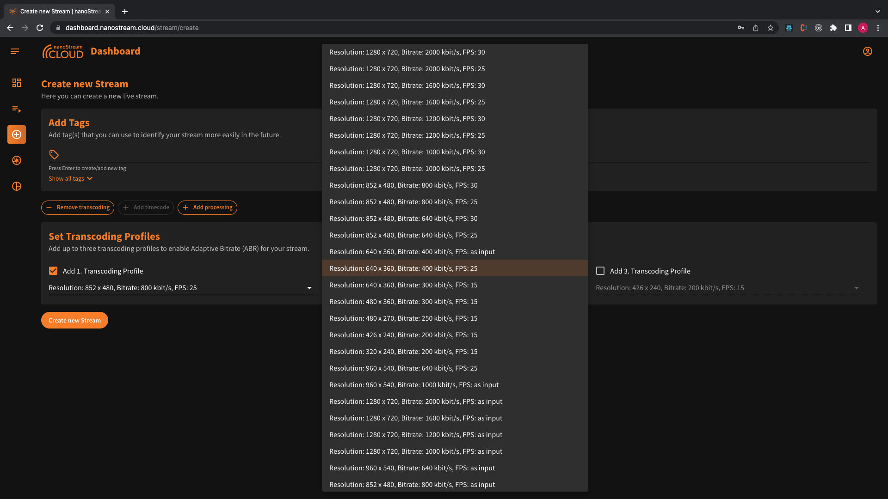
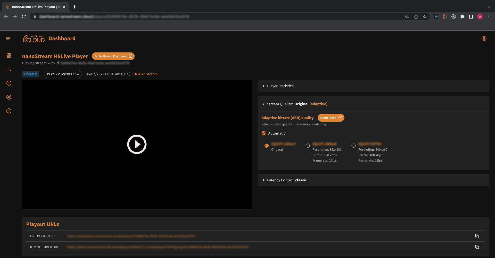

## Adaptive Bitrate (ABR)

### What is Adaptive Bitrate Playback?

Live playback of a live stream relies on a specific network bandwidth. If the viewer's network cannot support the required bandwidth, buffering issues may occur. To prevent buffering, the stream quality can be dynamically adjusted by switching to a lower quality stream encoded with a lower bitrate. Adaptive Bitrate Playback (ABR) is a feature that enables the live player to automatically adapt to the optimal stream quality based on the viewer's available network capacity.

For ABR to function effectively, the live stream needs to be available in multiple quality levels, allowing seamless adjustment according to the viewer's network bandwidth.

For instance, consider a live stream that offers a high-quality Full HD stream at 1920x1080 resolution with a bitrate of 3 Mbit/s, as well as a lower-resolution stream at 640x360 with a bitrate of 500 kBits/s. This enables viewers with varying network conditions to select the most suitable stream quality for their viewing experience.

*Infographic: Adaptive Bitrate Playback*

### How to enable Adaptive Bitrate

Adaptive Bitrate Playback with nanoPlayer does not require server-generated live transcoding. You can also create 3 live streams with the same content but different bitrates from your live encoder. Typically, live transcoding is done on the server to avoid sending 3 separate streams.

## Live Transcoding

### What is Live Transcoding?

Live Transcoding refers to the process of converting a high-quality input live stream into multiple lower-quality output streams. It eliminates the need to send multiple streams from the live encoder or broadcaster by dynamically generating additional formats suitable for distribution and playback at the player.

By employing live transcoding, a single high-quality input stream can be transformed into various output streams with different resolutions, bitrates, or other encoding parameters. This allows for efficient streaming to viewers with diverse network conditions and device capabilities, ensuring an optimal viewing experience for each user without the need for separate streams for each quality level.

Live transcoding simplifies the streaming workflow by enabling broadcasters to send a single stream while the transcoding system automatically generates the required output formats, reducing bandwidth and storage requirements. This process ensures that viewers can access the live stream in the most suitable quality based on their device capabilities and network conditions.

### How to enable Live Transcoding

You can enable Live Transcoding for your stream during the [stream creation](https://dashboard.nanostream.cloud/stream/create).

:::info Before starting
To begin, please sign in using your nanoStream Cloud/Bintu account credentials.  
If you have not created an account yet, you can [sign up](https://dashboard.nanostream.cloud/auth?signup) or reach out to our dedicated sales team via the [contact form](https://www.nanocosmos.de/contact) or by sending an email to sales(at)nanocosmos.de.
:::

*Screenshot: Create Stream and select Transcoding Profiles*

During the stream creation process live transcoding is already enabled by default. You have the option to add transcoding profiles and configure them according to your requirements. The default selection is pre-filled, but you can choose different settings. Ensure that the bitrate of each Transcoding Profile is lower than the ingest/passthrough bitrate or the profile above. Once you have completed the setup and created the stream, you can start broadcasting using your live encoder or the nanoStream Webcaster.

## Operation and Workflow

Transcoding and Adaptive Bitrate Playback (ABR) are built upon a group of streams. On the customer/viewer side, the stream switching occurs seamlessly in the background, depending on the internet connection. A typical configuration involves a single input stream (ingest) and three output streams, including one "passthrough" stream (maintaining the same input quality) and two lower-resolution streams.

### Example

- Input (Ingest) and Highest Quality: 1920x1080, 3 Mbit/s
- Output 1 (Passthrough): 1920x1080, 3 Mbit/s
- Transcode 1 (High): 1280x720, 1600 Kbit/s
- Transcode 2 (Medium): 852x480, 800 Kbit/s
- Transcode 3 (Low): 640x360, 400 Kbit/s

## Switch Stream Quality manually

*Screenshot: Stream Quality Switch*

On the playout page, you have the ability to adjust the stream quality manually by collapsing the stream qualities section labeled "Stream Quality: Original (adaptive)." By default, the adaptation is set to automatic, which allows the player to dynamically adjust the stream quality based on the viewer's network conditions. However, you can choose to switch to manual mode.

When in manual mode, you can switch between the stream names along with their corresponding qualities, including resolution, bitrate, and framerate. This gives you greater control over the playback experience and allows you to choose a specific quality that suits your preferences or requirements.

