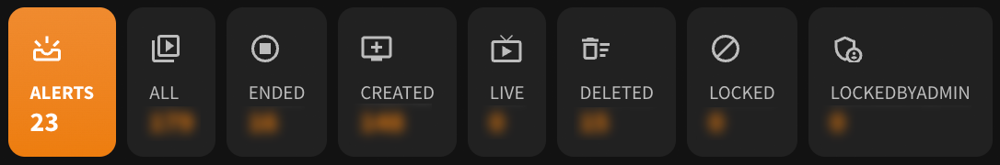
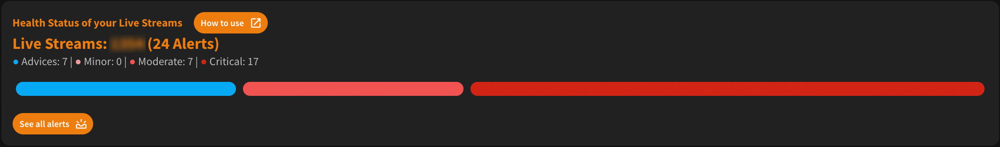
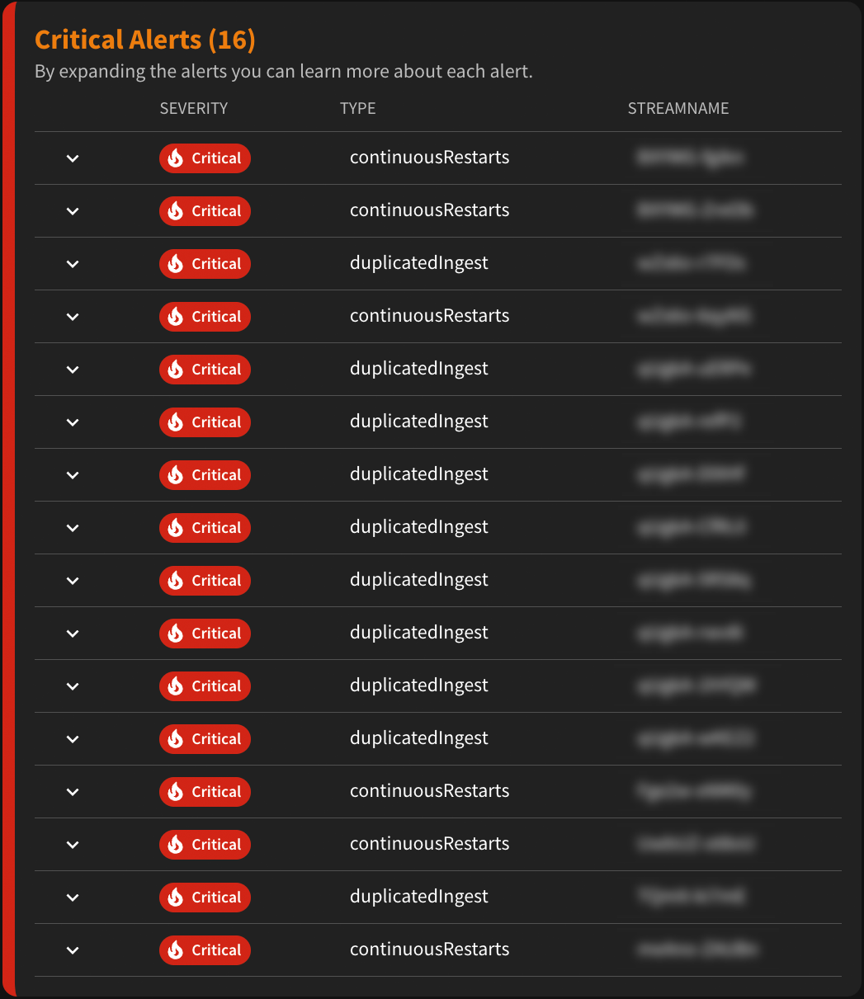
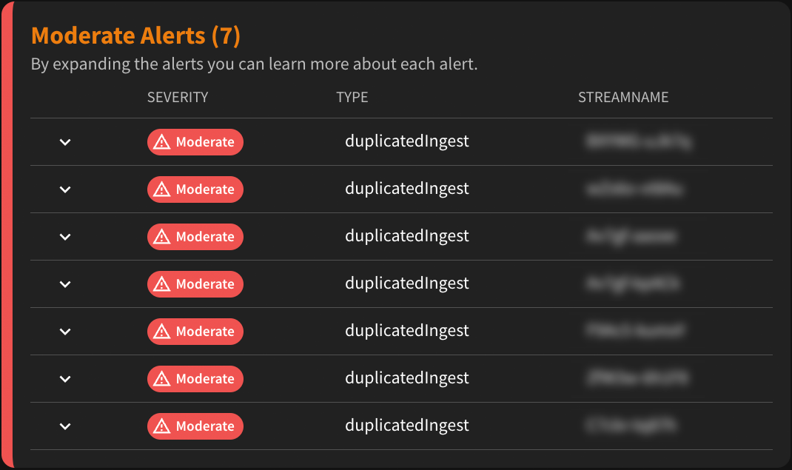
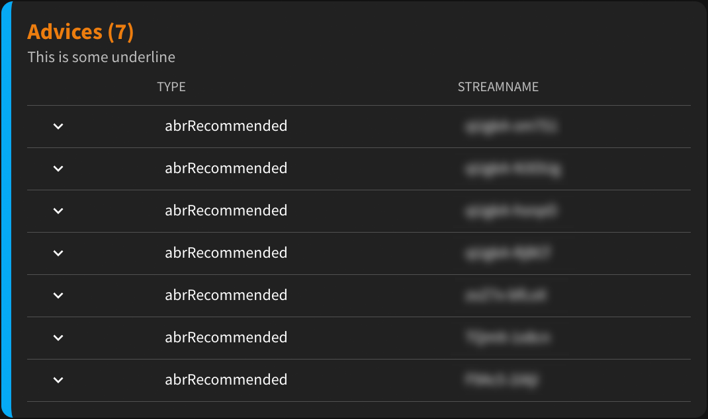
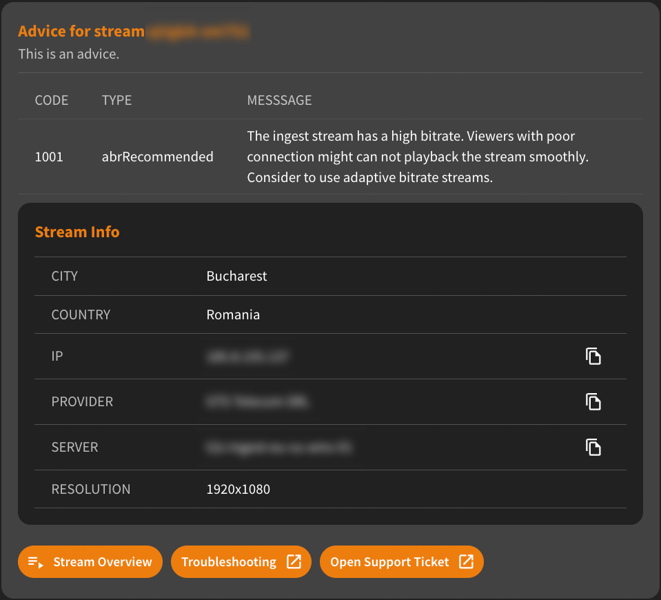
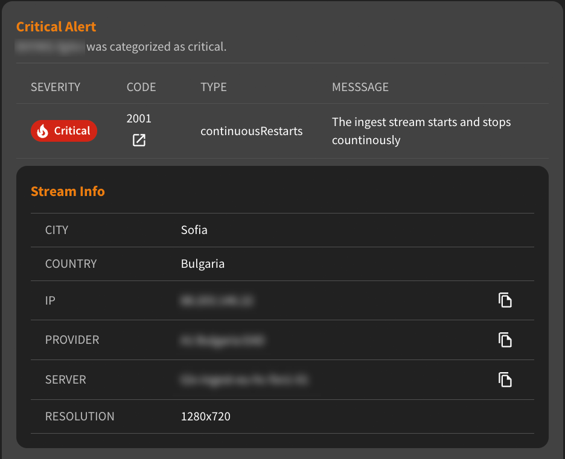
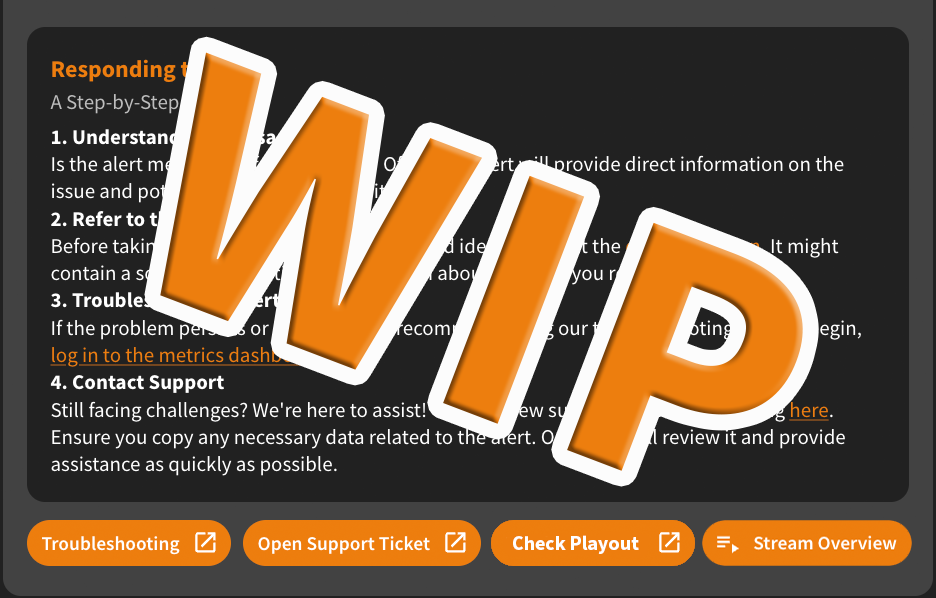

## What are Alerts and how to use them?
On this page you will learn how to use our Alerting feature using the nanoStream Cloud Dashboard. To get more general info about these handy additions, please visit our [Analytics documentation page](../cloud/stream-alerting.md/#introduction).

## Alert Overview

### Severity Distribution Overview

### Alert Tables

#### Alert Details 

#### Taking Action!
Below the detail section of each alert, you can find a step by step guide, that will help you handle the alerts initially by yourself.
 
- Check the playout
- Look into the stream overview for more details
- Make use of our Troubleshooting feature
- Submit a support ticket

