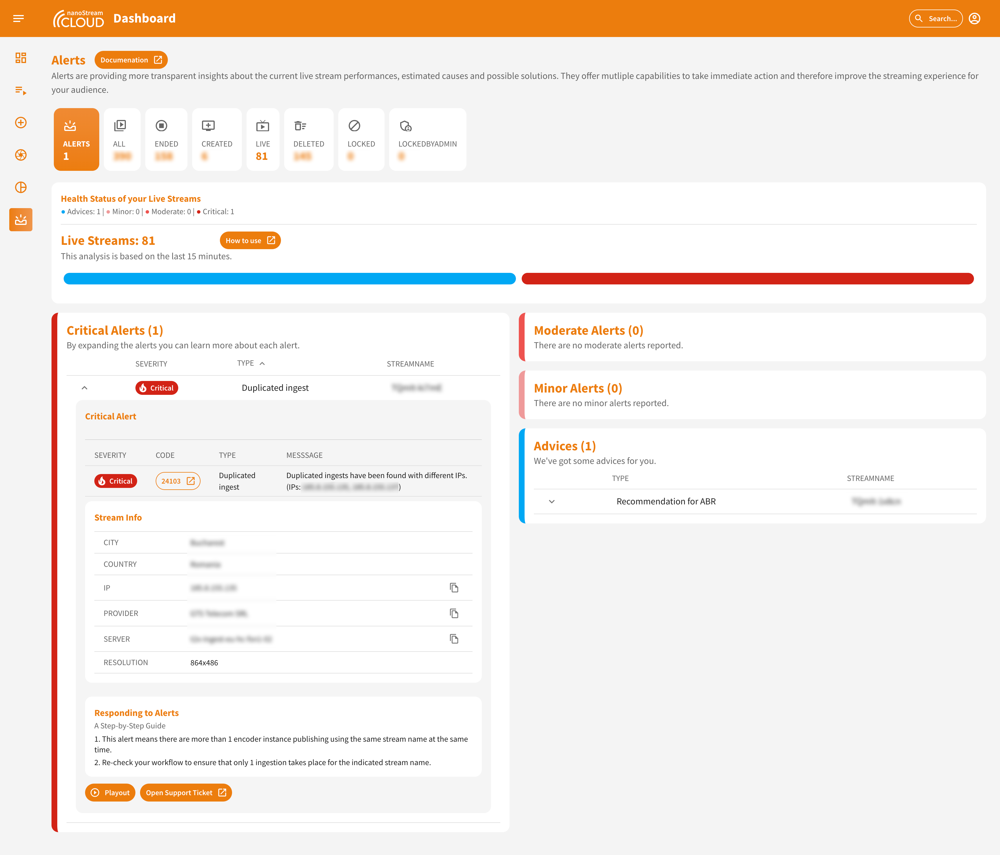

# Analytics: Alerts and Advices

:::note Analytics Enhancement from Version `3.7.1.0`
With the release of version `3.7.1.0`, the [nanoStream Cloud Dashboard](https://dashboard.nanostream.cloud/) has enhanced its user interface in addition to the [Analytics Dashboard](https://metrics.nanocosmos.de).
:::

## General

Alerts and advices are tools provided by nanoStream Cloud to give you real-time feedback and recommendations about your live streams. They provide invaluable insights into the performance of your live streams, potential issues, and even suggestions on how to enhance the viewer experience.

> All generated alerts and advices can be accessed in the nanoStream Cloud Dashboard [here](https://dashboard.nanostream.cloud/alerts).

:::info Before starting
To begin, please sign in using your nanoStream Cloud/Bintu account credentials.  
If you have not created an account yet, you can [sign up](https://dashboard.nanostream.cloud/auth?signup) or reach out to our dedicated sales team via the [contact form](https://www.nanocosmos.de/contact) or by sending an email to sales(at)nanocosmos.de.
:::

*Screenshot: Alerts and Advices*

At the top of the "Alerts" page, you'll find a comparative analysis indicating the total number of alerts in relation to the number of streams you have. This helps gauge the overall health of your live streams at a glance.

Below this, the health status of your live streams is depicted. If there are any alerts or advices associated with your streams, they'll be represented on a bar. This visual representation provides a quick insight into the number and type of alerts or advices you might have.

Further down, alerts and advices are categorized based on their severity levels. Each category can be expanded with a simple click, allowing you to delve deeper into the specifics of each alert or advice, helping you to address any concerns promptly.

:::info Details
Both alerts and advices within the nanoStream Cloud are fortified with detailed attributes to offer a comprehensive understanding of the streaming scenario:

#### Streaminfo:

- **City**: Pinpoints the city from which the stream originates.
- **Country**: Determines the country where the stream is broadcasted from.
- **IP Address**: Provides the specific IP address responsible for the stream's broadcast.
- **Provider**: Indicates the service provider managing the stream.
- **Server**: Specifies the server responsible for processing the stream.
- **Resolution**: Gives insight into the stream's quality and dimensions.

In addition to the stream-specific details, there are specific [alert informations](#alert-info) and [advice informations](#advice-info) attributes that relay crucial information. These characteristics are elaborated upon in the tables below, offering a dual-layer of intelligence for optimal stream management.
:::

## Alerts

Alerts are immediate notifications generated when there's a potential issue or a noteworthy event related to your live streams.

*Screenshot: Expanded Critical Alerts*

### Alert Info

| Field     | Value    | Explanation |
|-----------|---------------------------|-------------|
| Severity  | Critical | Critical, Moderate, Minor or Advices |
| Code      | `22001`                      | A unique code for the alert type. By clicking on the button, you will be redirected to the [analytics documentation](../cloud/stream-alerting.md#alert-codes), where you can learn what this specific error code means.|
| Type      | Continuous Restarts       | The nature of the alert.|
| Message   | The ingest stream starts and stops continuously. | A detailed description of the alert.|

### Responding to Alerts

:::tip nanoStream Analytics Documentation
To learn more about the *Alerts & Advices* feature, you can visit our dedicated [alerts documentation](../analytics/alerting) as part of our analytics documentation. You will be able to understand how it works and how to proceed once you get an alert or advice.
:::

**1. Understand the Message**:
Determine if the alert message is self-explanatory. Often, the alert might provide clear insights into the issue and potential remedies.

**2. Refer to the Documentation**:
Always consult the specific [alert code description](../cloud/stream-alerting.md#alert-codes) for a deeper understanding of the alert and the recommended corrective actions.

**3. Troubleshoot the Alert**:
If the problem persists or isn't evident, consider using our troubleshooting tools available on the [Analytics Dashboard](https://metrics.nanocosmos.de/troubleshooting). 

:::tip Troubleshooting
The troubleshooting page on the [Analytics Dashboard](https://metrics.nanocosmos.de/) helps to investigate stream or user specific metrics across the streaming experience from stream ingest to the playout at the enduser.  
Learn more on how to troubleshoot [here](../analytics/troubleshooting).
:::

**4. Contact Support**:
If challenges persist, we're here to help! [Create a new support request](https://www.nanocosmos.de/support) and ensure you attach all relevant data related to the alert. Our team will address your concerns promptly.

## Advices

Advices provide recommendations and best practices to enhance the quality and viewer experience of your live streams.

### Advice Info

| Field     | Value                                                              | Explanation |
|-----------|--------------------------------------------------------------------|-------------|
| Code      | `29001`                                                            | A unique code for the advice type. Read more [here](../cloud/stream-alerting.md#advice-codes).|
| Type      | ABR Recommended                                                    | The nature of the advice. |
| Message   | The ingest stream has a high bitrate. Consider using adaptive bitrate streams to ensure smooth playback for viewers with poor connections. | A detailed description of the advice, providing actionable recommendations. |
