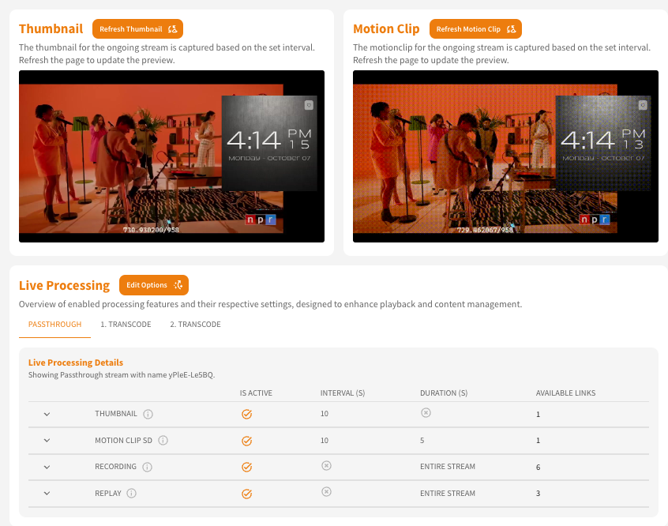
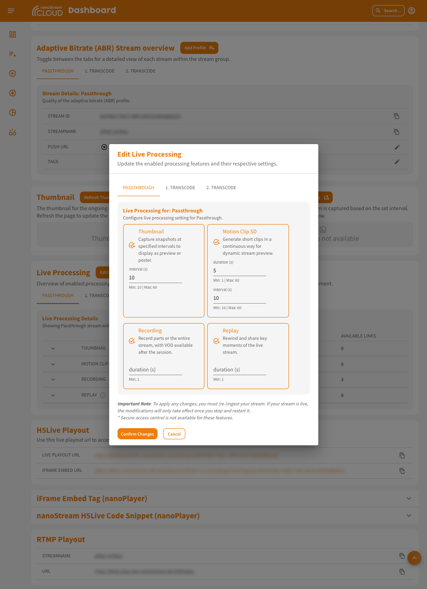

Live streaming goes beyond simply delivering video and audio to viewers. **Live Processing** adds advanced functionalities to your streams, enabling features like recording, thumbnail and motion clip generation and replay capabilities. These features enhance the viewer experience and give broadcasters greater flexibility in managing and optimizing their live content in real-time. With the **`Bintu API v1.24.1`**, we introduced several new live processing capabilities, that can be configured easily during stream setup or adjusted as the broadcasters streaming requirements evolve. 

:::tip  Prerequisites
Before you get started, make sure you have an active bintu account, whether it's part of a trial or a paid plan.  
To use the **`live processing`** feature, ensure it is enabled for your account. You can verify this by checking your [Organisation Overview](https://dashboard.nanostream.cloud/organisation).

If you have not created an account or enabled the feature yet, you can [sign up](https://dashboard.nanostream.cloud/auth?signup) or reach out to our dedicated sales team via the [contact form](https://www.nanocosmos.de/contact) or by sending an email to sales(at)nanocosmos.de.

For more details, visit our [Homepage: Overview and Plans](https://info.nanocosmos.de/)
:::

:::caution Please Note
* Additional charges may apply based on actual usage and package limits.
* Please note that **secure access control** is not available for these features.
:::

## Configuring Live Processing Options

To configure the live processing options, follow the steps during the [stream creation process](Dashboard_Start_Streaming#add-live-processing). Live processing options can be enabled by default or added later as required.

*Screenshot: Live Processing Activation during Stream Creation*

Depending on whether **transcoding** is enabled, tabs for each stream will appear in the *Live Processing Section*. For each stream, you can select whether to activate live processing and which options to enable. The summary of your selections is displayed in the blue box next to the tabs, allowing you to review your choices.

## Overview of Live Processing Options

The Live Processing feature has its own section in the **Stream Overview**. This section displays the **Thumbnails** and **Motion Clips** (as GIFs) alongside a table providing an overview of the information related to live processing for the selected stream.

*Screenshot: Live Processing Overview, including Thumbnail, Motionclip and a resource table*

By clicking on the button "Edit Options" next to the title you can [edit your selections](#modifying-live-processing-options). It also allows you to review the current settings. The listed options show whether each option is active, the configured **interval** (in seconds), the **duration** (in seconds), and the number of available resource links.

## Output Links and Assets

When expanding the links for active processes, you will see the URLs for each resource. 

*Screenshot: Expanded Live Processing Table showing the available resources for each option*

- For **motion clips** and **thumbnails** you can find generic URLs that lead to the corresponding files.
- For **recordings**, you’ll also find the date and time of each session next to the resource link. 
- For **replay**, three different links are provided, directing you to demo tools:
    - **Latest Live Session**: Clicking "Clip & Share Latest Live Session" leads you to the demo page, where, in addition to viewing the live stream, you can use the **Clipping Tool** to create live clips.
    - **Watch Replay**: This link allows you to replay the selected session.
    - **Clip & Share**: Here, you can clip the selected session and share it.

*Screenshot: Live Clipping and Share Demo*

## Modifying Live Processing Options

You can modify live processing settings at any time. **However, it’s important to note that the stream must be re-ingested for the changes to take effect.**

Through separate tabs, you can select the stream you want to modify and update the live processing values.

*Screenshot: Edit Live Processing*