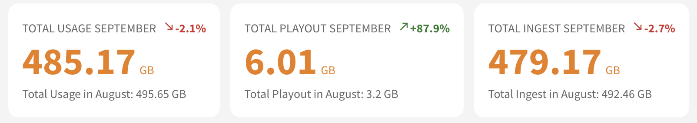
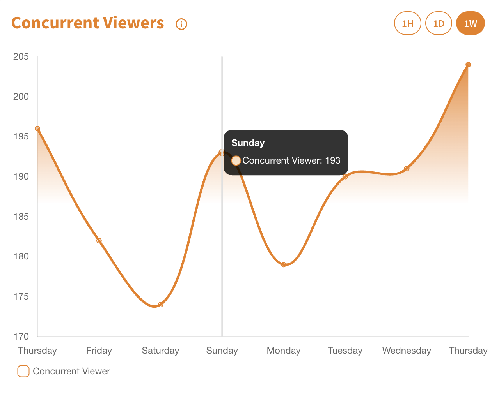
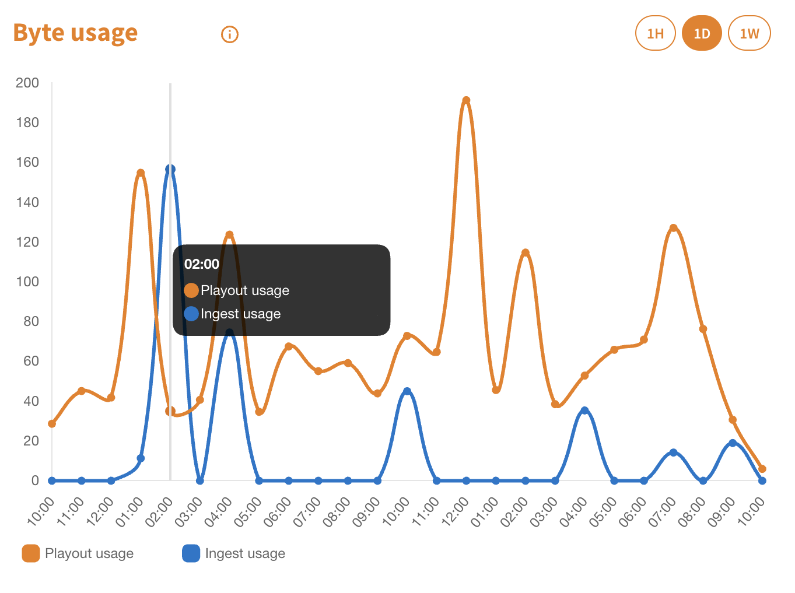

As the digital landscape progresses, real-time monitoring and analytics play a crucial role in ensuring the efficiency and performance of live streams. Integrating nanoStream Analytics API with the nanoStream Cloud Customer Dashboard enhances your ability to monitor and analyze live streams in terms of performance and the quality of service.

## Getting Started

The essence of nanoStream Analytics is to grant you a clear understanding of how your live streams are functioning. It provides insights into the performance metrics and the quality of service of your streams, allowing you to pinpoint issues, make improvements, or even understand the preferences and behaviors of your viewers.

:::info Before starting
To begin, please sign in using your nanoStream Cloud/Bintu account credentials.  
If you have not created an account yet, you can [sign up](https://dashboard.nanostream.cloud/auth?signup) or reach out to our dedicated sales team via the [contact form](https://www.nanocosmos.de/contact) or by sending an email to sales(at)nanocosmos.de.
:::

## Month to Date Usage

The *Month to Date Usage* feature provides a comparative analysis of the current month's usage of your organization against the previous month. 
This comparative analysis is crucial to understand your stream's growth trajectory and to make informed decisions based on past trends.

> [Click here](https://dashboard.nanostream.cloud) to see this metric.

*Screenshot: Month to Date Usage*

### Total Usage *Month*
Represents the aggregate traffic for the ongoing month. It encompasses both ingest and playout traffic, offering a holistic view of your stream's overall traffic.

### Total Playout *Month*
Exclusively displays the playout traffic for the month. This metric is pivotal in understanding viewer engagement and the reach of your streams.

### Total Ingest *Month*
Focuses on the total ingest for the current month, providing clarity on the amount of data your streams are taking in.

:::tip example
Consider today's date as September 16th.
- Last month, up to August 16th, you generated 300GB of traffic.
- This month, as of September 16th, you've generated 325GB.

Therefore, as of September 16th, your traffic has increased by **8.33%** compared to the same date in the previous month.
:::

## Concurrent Viewer

The Concurrent Viewer section provides insights into the "Time series of maximum concurrent viewers" for your organization's streams, giving you a visual representation of viewer engagement over a specific duration.

> [Click here](https://dashboard.nanostream.cloud/metrics) to see this metric.

:::info benefit
This feature helps in understanding your audience's behavior, peak viewing times, and helps in forecasting future trends based on past data.
:::

Hovering over the chart will display tooltip data, revealing exact numbers of concurrent viewers and the corresponding time stamp.  
You can filter the time series based on three presets on the top right:

- **Last Hour (1H)**: View concurrent viewer data from the past 60 minutes.
- **Last Day (1D)**: Get insights spanning the previous 24 hours.
- **Last Week (1W)**: Understand viewer trends over the last 7 days.

*Screenshot: Concurrent Viewer*

## Byte Usage (Ingest / Playout)

The Byte Usage section offers a detailed breakdown of the data usage patterns, focusing specifically on ingest (data being sent to the server) and playout (data being broadcasted to viewers) traffic.

> [Click here](https://dashboard.nanostream.cloud/metrics) to see this metric.

The chart provides a dual-layered visual comparison, with separate lines depicting the byte usage for both ingest and playout. This allows you to quickly discern which aspect of your streaming operation is consuming more bandwidth at any given time.

:::info Benefit
This metric provides a comprehensive look at your streaming infrastructure's efficiency, helping identify potential bottlenecks or areas for optimization in your data handling process.
:::

By hovering over the chart, users can see tooltip data, pinpointing exact byte usage values and their respective timestamps.  
You can filter the time series based on three presets on the top right:

- **Last Hour (1H)**: View concurrent viewer data from the past 60 minutes.
- **Last Day (1D)**: Get insights spanning the previous 24 hours.
- **Last Week (1W)**: Understand viewer trends over the last 7 days.

*Screenshot: Byte Usage (Ingest / Playout)*