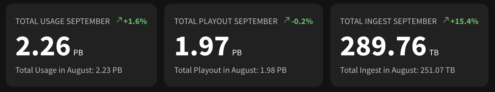
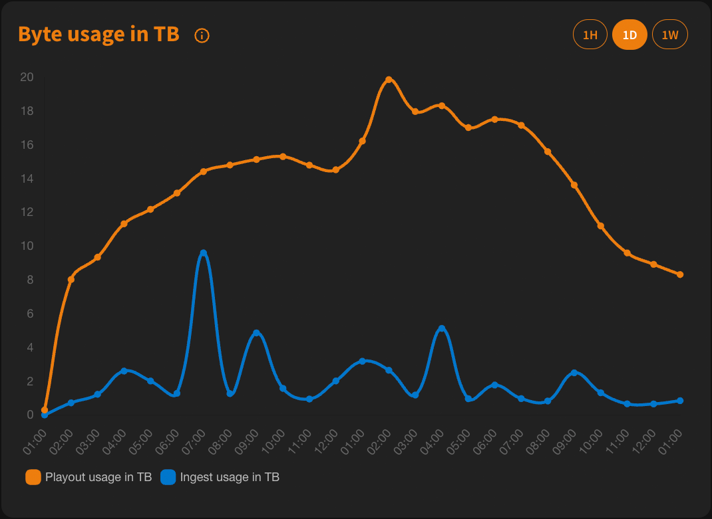
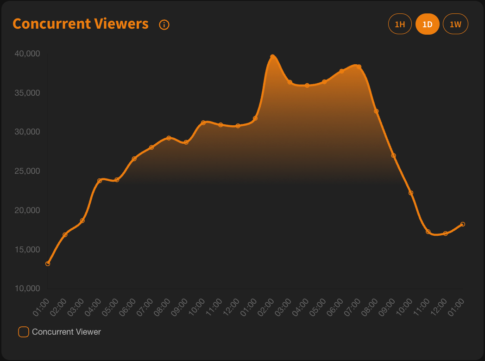

## Metrics are now coming to the nanostream Cloud Dashboard!
We are really excited to show you a glimps of what to expect in the near future!

### Byte Usage Overview
This does provide a month to date traffic comparison for the current and the last month.

### Charts 
To get started, select the **Metrics** tab on the left sidebar in the dashboard.

## There are many more metrics joining the party very soon, so stay tuned!