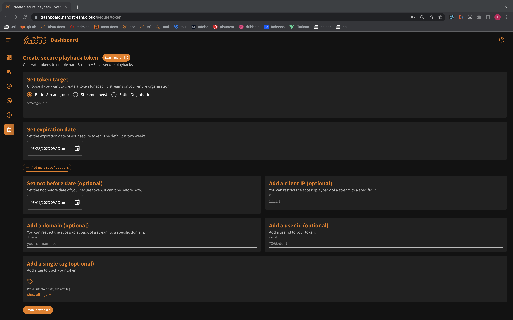

Secure Playback Tokens are a valuable tool that enhances the security of your streams by providing controlled access. With these tokens, you have the ability to decide who can play back your stream, ensuring that only authorized viewers can access your content. The regular playout URL alone will not grant playback privileges.

:::info Enable Secure Feature
If you are interested in utilizing the `secure` feature offered by nanoStream Cloud, please ensure that it is enabled for your account. You can check that on the "[Organisation Overview](https://dashboard.nanostream.cloud/organisation)“ (1). If it is not enabled, or if you have any inquiries regarding this feature, we recommend reaching out to our [sales team](https://www.nanocosmos.de/support). They will be more than happy to provide you with the necessary information and guide you through the process to enable this feature.
:::


*Screenshot: Enabled Features*

## Token Configuation


:::info Before starting
To begin, please sign in using your nanoStream Cloud/Bintu account credentials. <br/>
If you have not created an account yet, you can [sign up](https://dashboard.nanostream.cloud/auth?signup) or reach out to our dedicated sales team via the [contact form](https://www.nanocosmos.de/contact) or by sending an email to sales(at)nanocosmos.de.
:::

One way to create a secure token for your stream(s) or organisation is to navigate to the left-hand menu and select the lock icon. This will take you to the [page](https://dashboard.nanostream.cloud/secure/token) where you can provide the necessary information to generate the token. You can also find this dialog in different sections of the nanoStream Cloud dashboard.

### Required Informations

1. **Token Target**: Choose the target of the token.
   - The entire stream group by providing the stream ID
   - specify multiple stream names or
   - select the entire organization
2. **Expiration Date**: The default expiration date is set to 2 weeks, but you can choose any duration you prefer.

### Optional Information

1. **Not Before Date** (optional): Set the "not before" date to ensure that the token is not valid before a specific date.
2. **Client IP** (optional): Restrict access to streams to a specific client IP address.
3. **Domain** (optional): Restrict the stream to a specific domain.
4. **UserID** (optional): Add a user ID to your token for identification purposes.
5. **Tag** (optional): Add a single tag to track your token.


*Screenshot: Create secure playback token*

By providing the required information and optionally configuring specific options, you can generate a token that meets your security requirements by clicking on „Create new token“. It is important to manage and safeguard your tokens to ensure the secure playback of your streams.

### Token Overview

Once you clicked on the "Create" button, you will be redirected to an overview page displaying the details of the token you just created. This overview will include all the specifications you set up, such as the token target, expiration date, and any optional configurations you specified.

Additionally, you will receive a security config object that you can copy. This object can be pasted into either the group object or the entries element of your player configuration.

```js
security: {
	jwtoken: yOurSecureTokeNForYoURsTReaM
}
```
*Code Snippet: Security Property*

:::tip
Please note that integrating the security config object correctly into your player configuration is crucial for the secure playback of your streams. On our documentation we provide also more information about [secure playbacks with JSON Web Token (JWT)](../nanoplayer/nanoplayer_feature_security_jwt).
:::

## Token Creation Dialog

In addition to the token creation page, you can also find the token information and create new tokens within specific sections of the nanoStream Cloud dashboard. By default, the platform uses the organization token generated for your login session. However, please exercise caution with this token to prevent unauthorized access to your streams.

You can find the inline token creation dialog in the following pages:

- **Stream Instructions**: In the stream instructions section, you can view the token information and create new tokens for your streams.
- **Stream Overview**: On the stream overview page, you have access to the token creation dialog where you can generate secure tokens for your streams.
- **Playout Page**: Similarly, on the playout page, you can find the dialog for creating secure tokens.


*Screenshot: Token Creation Dialog in Stream Overview*

:::info
For any additional assistance or questions regarding token creation, our [support team is available to help](https://www.nanocosmos.de/support).
:::
