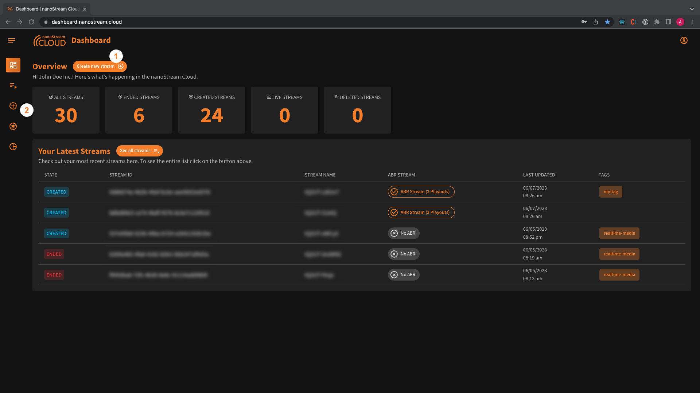
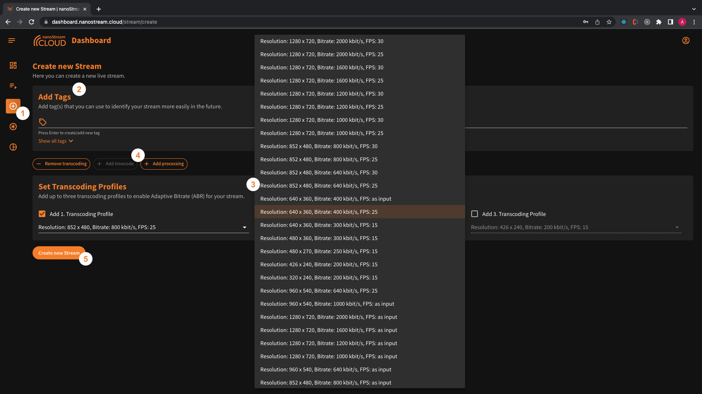

:::info Before starting
To begin, please sign in using your nanoStream Cloud/Bintu account credentials.  
If you have not created an account yet, you can [sign up](https://dashboard.nanostream.cloud/auth?signup) or reach out to our dedicated sales team via the [contact form](https://www.nanocosmos.de/contact) or by sending an email to sales(at)nanocosmos.de.
:::

Locate the "[Create New Stream](https://dashboard.nanostream.cloud/stream/create)" button either next to dashboard overview title (1). Alternatively, you can also navigate to the left-hand side menu, choose the „Outlined Plus Circle“ Icon (2).

*Screenshot: Navigation to Stream Creation*

## Setting up and creating a stream

1. Access the nanoStream Cloud Dashboard and navigate to the stream creation section.
2. You have the option to add stream tags. You can either manually enter tags or choose from your existing ones, making it easier to categorize and identify your streams.
3. For enhanced streaming quality, you have the option to configure transcoding profiles. You can define up to three profiles that enable Adaptive Bitrate (ABR) streaming. These profiles provide multiple quality versions of the stream, ensuring optimal playback across different network conditions.
4. The dashboard also offers advanced features like `timecodes` and `live processing`, but please note that these features are available as paid options. Timecodes allow precise synchronization or indexing of video content, while live processing enables real-time modifications or effects during the streaming process. If you wish to utilize these features, you would need to activate them and ensure that the corresponding pricing and payment options are set up. 
Contact us [here](https://www.nanocosmos.de/contact) to find the perfect solution for you!
5. After customizing your stream with tags, transcoding profiles, and any additional features, click on „create new stream“. E voila - you created a new stream. :)

*Screenshot: Create Stream*

## Start Streaming

After clicking on "Create New Stream“, you will be redirected to the easy instructions page. This page provides you with all the information required to begin streaming, including the necessary steps and details for a seamless setup.

The information is presented in three sections:

1. **Start the Ingest**: Here, you'll find the ingest details, including the RTMP stream name and RTMP URL. To easily copy these details, simply click on the copy icon provided at the end of the row.
2. **Access the Web Playout**: In this section, you'll discover the live playout URL. Clicking on it will also reveal a code snippet. This code snippet contains everything you need to embed the H5Live Player with your stream onto your web page.

:::info
Additionally, the dashboard offers the `secure` option (if enabled) to generate a playback token. During your logged-in session, you have a jwt token that is valid for the whole organisation and lets you watch every stream. Alternatively, you can create a new stream JWT token with an expiration date. This token can be valid for the entire organization, specific stream groups, or individual stream names. You can specify options such as "not before" date, client IP, domain, user ID, or a single tag for added security and control. Contact us [here](https://www.nanocosmos.de/contact) to enable the `secure` feature for you!
:::
3. **Stream Overvie**w: This section provides a link to the stream's overview page. By clicking on the URL, you can access the complete stream overview, which includes various other relevant details.

*Screenshot: Easy Instructions to the live stream*

By following these instructions, you can start your stream smoothly, access playout options, generate playback tokens with specific configurations, and embed the nanoStream H5Live Player on your webpage using the provided code snippets or iFrame tag.

Once you have accessed this page, you have two options for broadcasting a live streaming:

### Option 1: Use the nanoStream Webcaster

…wip…

### Option 2: Use a separate live encoder software or hardware:

- Configure your preferred live encoder software or hardware, such as OBS or Wirecast, according to the setup instructions.
- Obtain the necessary RTMP stream details (stream name and URL) from the "Ingest" section on the stream creation or easy instructions page.
- Enter the RTMP stream details into your live encoder settings.
- Start the live stream from your encoder to begin sending the video feed to nanoStream Cloud.

:::info Additional Resources
- Read more about [how to use OBS for Low Latency Live Encoding to nanoStream Cloud](https://www.nanocosmos.de/blog/2019/03/how-to-use-obs-for-low-latency-live-encoding-to-nanostream-cloud/).
- Find also [instructions how to use Wirecast with nanoStream Cloud](https://www.nanocosmos.de/blog/2020/12/how-to-use-wirecast-with-nanostream-cloud-for-ultra-low-latency-live-streaming/) in our blog.
:::
