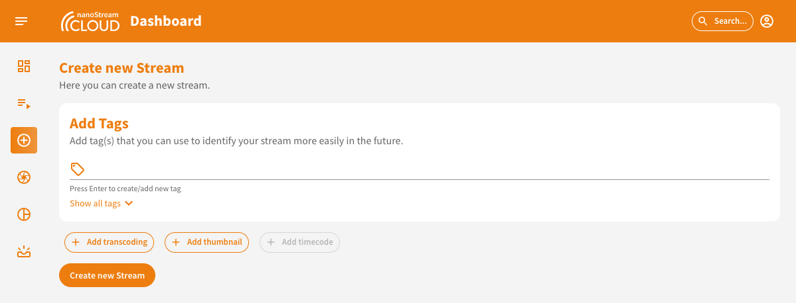
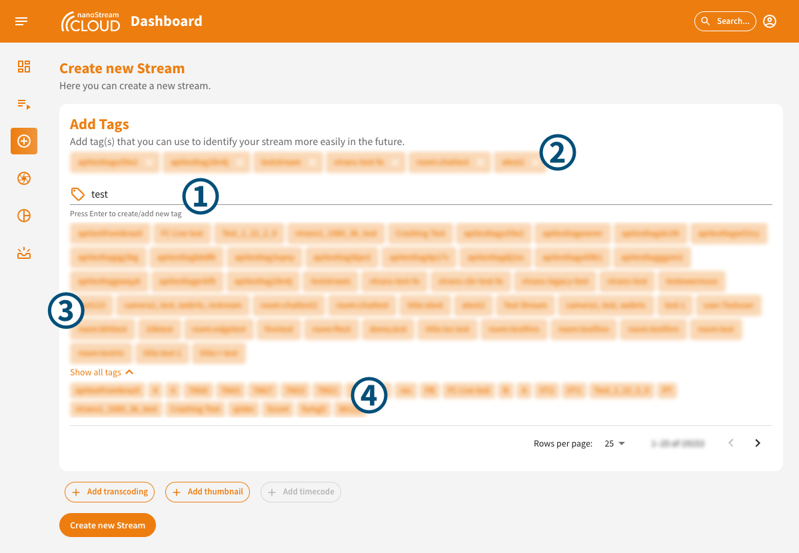
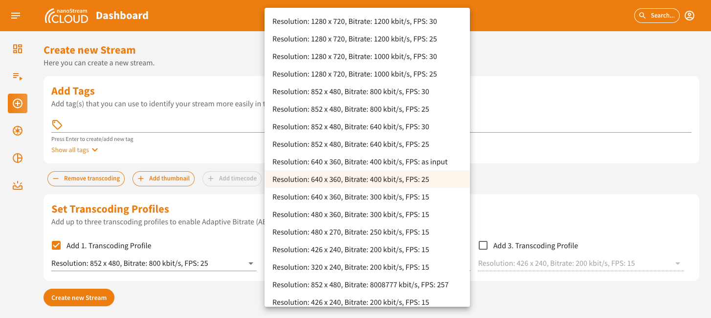
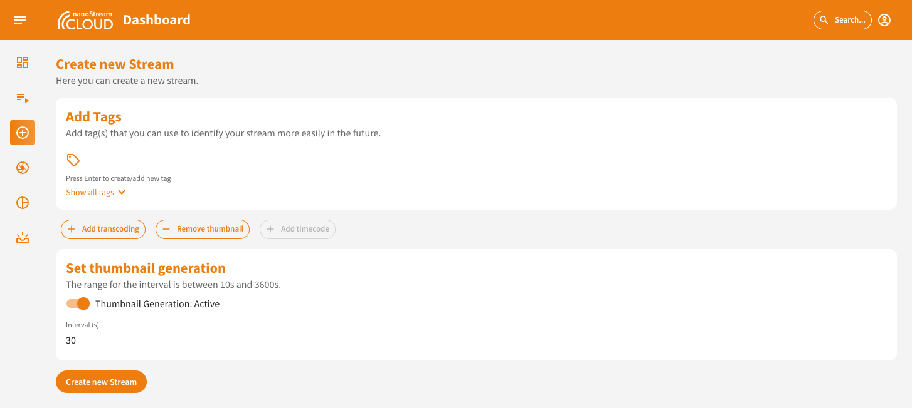
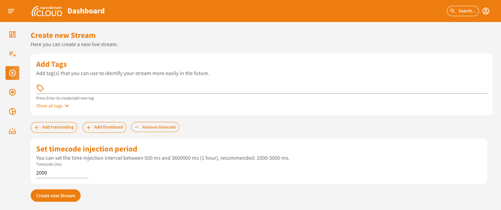
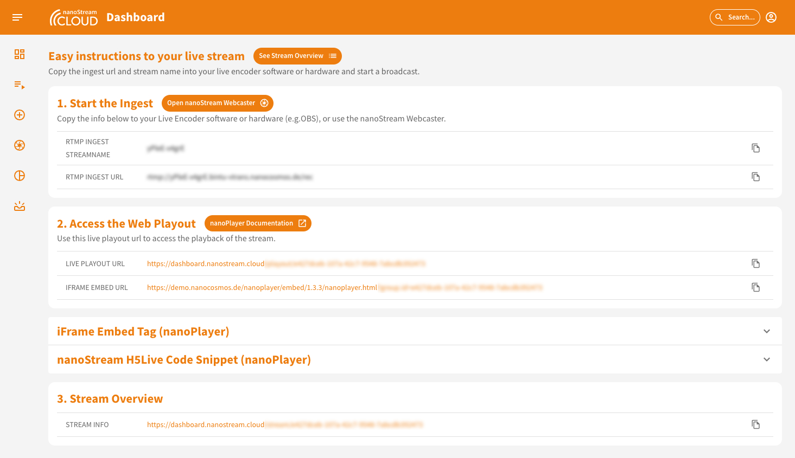
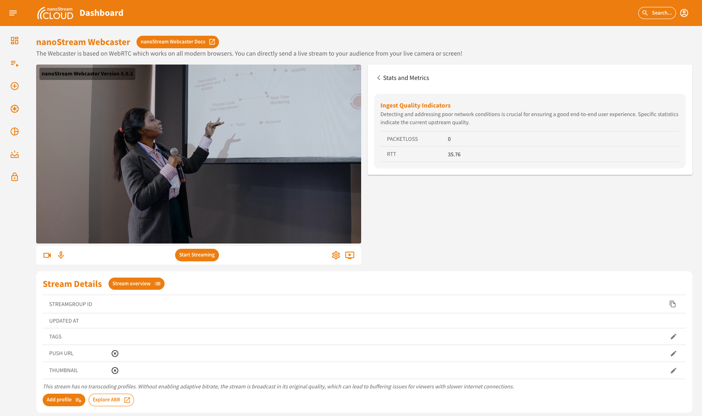
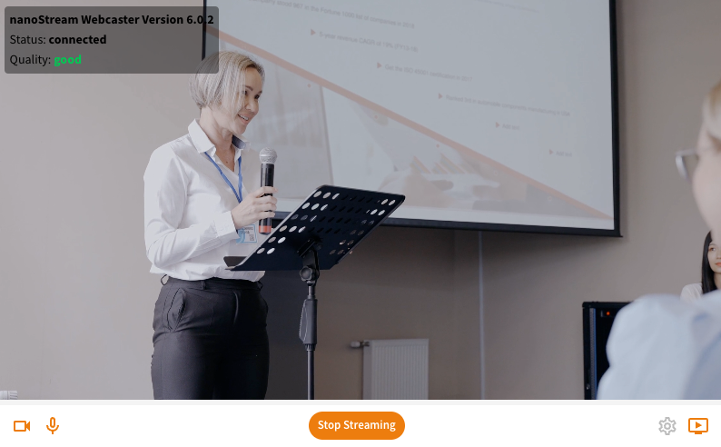

:::info Before starting
To begin, please sign in using your nanoStream Cloud/Bintu account credentials.  
If you have not created an account yet, you can [sign up](https://dashboard.nanostream.cloud/auth?signup) or reach out to our dedicated sales team via the [contact form](https://www.nanocosmos.de/contact) or by sending an email to sales(at)nanocosmos.de.
:::

Locate the "[Create New Stream](https://dashboard.nanostream.cloud/stream/create)" button either next to dashboard overview title (1). Alternatively, you can also navigate to the left-hand side menu, choose the „Outlined Plus Circle“ Icon (2).

*Screenshot: Navigation to Stream Creation*

## Setting up and creating a stream

You can access the stream creation page using the menu on the left. You can tell whether you are on the right page when the round plus icon is highlighted in orange and you can see the UI as shown in the screenshot.

*Screenshot: Create Stream*

### Add Tags

In the "Add Tags" section you can add tag(s) to identify your stream more easily in the future. 
1. You can enter in the text field a tag that you want to add. 
2. By hitting "Enter" they will be added to the list above the text field and are added to the stream you are about to create.
3. From the 3rd letter in the text field, it will be checked if you have used such a series of characters in the past and all tags that contain these three letters will be suggested to you. By clicking on them, they will also be added to the list (see 2).
4. Independently if you have already typed something, you can press "Show all tags" and see the last tags you have used in the organization. You can scroll through them all using the menu at the bottom right. By clicking on them you can add them to the list of your tags (see 2).

*Screenshot: Addition of Tags during Stream Creation*

### Add Transcoding

During the stream creation process live transcoding is already enabled by default. You have the option to add transcoding profiles and configure them according to your requirements. The default selection is pre-filled, but you can choose different settings. Ensure that the bitrate of each Transcoding Profile is lower than the ingest/passthrough bitrate or the profile above.

:::tip Adaptive Bitrate (ABR) and Live Transcoding
To learn more about Adaptive Bitrate (ABR) and Live Transcoding, you can have a look here:
- [What is Adaptive Bitrate Playback?](Dashboard_ABR_Transcoding#what-is-adaptive-bitrate-playback)
- [What is Live Transcoding?](Dashboard_ABR_Transcoding#what-is-live-transcoding)
:::

*Screenshot: Create Stream and select Transcoding Profiles*

:::info Modifying Transcoding Profiles After Stream Creation
As your streaming requirements evolve, you may find the need to revise your transcoding profiles. Learn more about this here:
- [Modifying Transcoding Profiles After Stream Creation](Dashboard_ABR_Transcoding#modifying-transcoding-profiles-after-stream-creation)
- [Transform a Non-Transcoding Stream into an ABR Stream](Dashboard_ABR_Transcoding#transform-a-non-transcoding-stream-into-an-abr-stream)
- [Integrating Additional Profiles to Your Streamgroup](Dashboard_ABR_Transcoding#integrating-additional-profiles-to-your-streamgroup)
- [Edit profiles](Dashboard_ABR_Transcoding#edit-profiles) or [Delete profiles](Dashboard_ABR_Transcoding#delete-profiles)
:::

### Add thumbnail

By clicking on "Add thumbnail" you can enable the thumbnail generation and select an interval for the creation. This can range from 10 to 3600 seconds. The default is set to 30s. The thumbnail will be generated based on the selected interval.

*Screenshot: Thumbnail Activation during Stream Creation*

:::tip Learn more
- [Setting up thumbnails after stream creation](Dashboard_Thumbnail#setting-up-thumbnails)
- [Updating thumbnail settings after stream creation](Dashboard_Thumbnail#updating-settings)
:::

### Add timecode injection

:::info Enabling `timecode` feature
If you wish to utilize this feature, you would need to activate them and ensure that the corresponding pricing and payment options are set up. 
Contact us [here](https://www.nanocosmos.de/contact) to find the perfect solution for you!
:::

By clicking on "Add timecode" you can enable this feature. It allows precise synchronization or indexing of video content. You can set the time injection interval between 500 ms and 3600000 ms (1 hour), recommended: 1000-5000 ms. The default is 2000ms. 

*Screenshot: Timecode Injection during Stream Creation*

## Start Streaming

After clicking on "Create New Stream“, you will be redirected to the easy instructions page. This page provides you with all the information required to begin streaming, including the necessary steps and details for a seamless setup.

The information is presented in three sections:

1. **Start the Ingest**: Here, you'll find the ingest details, including the RTMP stream name and RTMP URL. To easily copy these details, simply click on the copy icon provided at the end of the row.
2. **Access the Web Playout**: In this section, you'll discover the live playout URL. Clicking on it will also reveal a code snippet. This code snippet contains everything you need to embed the H5Live Player with your stream onto your web page.

:::info
Additionally, the dashboard offers the `secure` option (if enabled) to generate a playback token. During your logged-in session, you have a jwt token that is valid for the whole organisation and lets you watch every stream. Alternatively, you can create a new stream JWT token with an expiration date. This token can be valid for the entire organization, specific stream groups, or individual stream names. You can specify options such as "not before" date, client IP, domain, user ID, or a single tag for added security and control. Contact us [here](https://www.nanocosmos.de/contact) to enable the `secure` feature for you!
:::
3. **Stream Overview**: This section provides a link to the stream's overview page. By clicking on the URL, you can access the complete stream overview, which includes various other relevant details.

*Screenshot: Easy Instructions to the live stream*

By following these instructions, you can start your stream smoothly, access playout options, generate playback tokens with specific configurations, and embed the nanoStream H5Live Player on your webpage using the provided code snippets or iFrame tag.

Once you have accessed this page, you have two options for broadcasting a live streaming:

## Option 1: Use the nanoStream Webcaster

The Webcaster interface is designed with simplicity and efficiency in mind, offering key elements that make live streaming easy.

*Screenshot: Webcaster Integration in the Dashboard*

The Webcaster interface, shown in the screenshot above, is divided into three main sections: 
- Top left: The webcaster itself,
- Top right: Real-time metrics and
- Bottom: The usual stream details at the bottom.

*Screenshot: Webcaster Close Up*

In the top corner, you can easily identify the version of the Webcaster API in use. Once you begin streaming, the interface displays information such as connection status and stream quality.

### Toolbar

The Toolbar, located below the webcaster, acts as your command center, providing quick access to essential functions:

- **Camera On/Off**: Toggle your camera.
- **Audio On/Off**: Control your audio input.
- **Start/Stop Streaming**: Initiate or conclude your live stream.
- **Settings**: Access detailed customization options.
- **Playout Link**: Quickly retrieve the link to share your live stream.

### Settings

Tailor your streaming experience with the nanoStream Webcaster settings, accessible when you are not actively streaming.

*Screenshot: Webcaster Settings*

1. **Video Source**: Choose between video feed from your camera or screen sharing. If you opt for screen sharing, a dedicated dialog will appear upon application of changes, allowing you to select the specific screen. Should you wish to switch to a different window, revisit the settings, click on screenshare again, and apply changes.

2. **Video Quality**: Adjust the maximum video bitrate, resolution, and framerate according to your preferences. Fine-tune these settings to achieve the desired balance between video quality and bandwidth efficiency.

3. **Audio Configuration**: Select your preferred audio input device and set the maximum bitrate to ensure optimal audio quality during your stream.

### Metrics

The metrics section provides crucial information, including *Packet Loss* (Packetloss) and *Round-Trip Time* (RTT). Packet Loss is a vital metric for checking stream health, while RTT offers insights into stream performance and responsiveness.

## Option 2: Use a separate live encoder software or hardware:

- Configure your preferred live encoder software or hardware, such as OBS or Wirecast, according to the setup instructions.
- Obtain the necessary RTMP stream details (stream name and URL) from the "Ingest" section on the stream creation or easy instructions page.
- Enter the RTMP stream details into your live encoder settings.
- Start the live stream from your encoder to begin sending the video feed to nanoStream Cloud.

:::info Additional Resources
- Read more about [how to use OBS for Low Latency Live Encoding to nanoStream Cloud](https://www.nanocosmos.de/blog/2019/03/how-to-use-obs-for-low-latency-live-encoding-to-nanostream-cloud/).
- Find also [instructions how to use Wirecast with nanoStream Cloud](https://www.nanocosmos.de/blog/2020/12/how-to-use-wirecast-with-nanostream-cloud-for-ultra-low-latency-live-streaming/) in our blog.
:::
