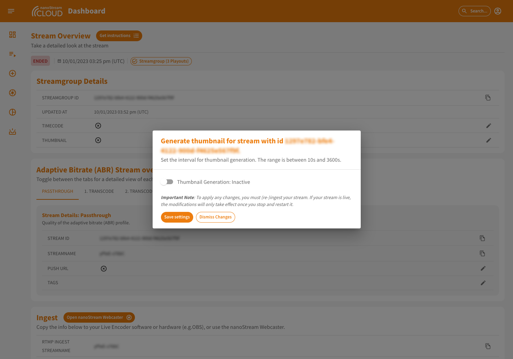
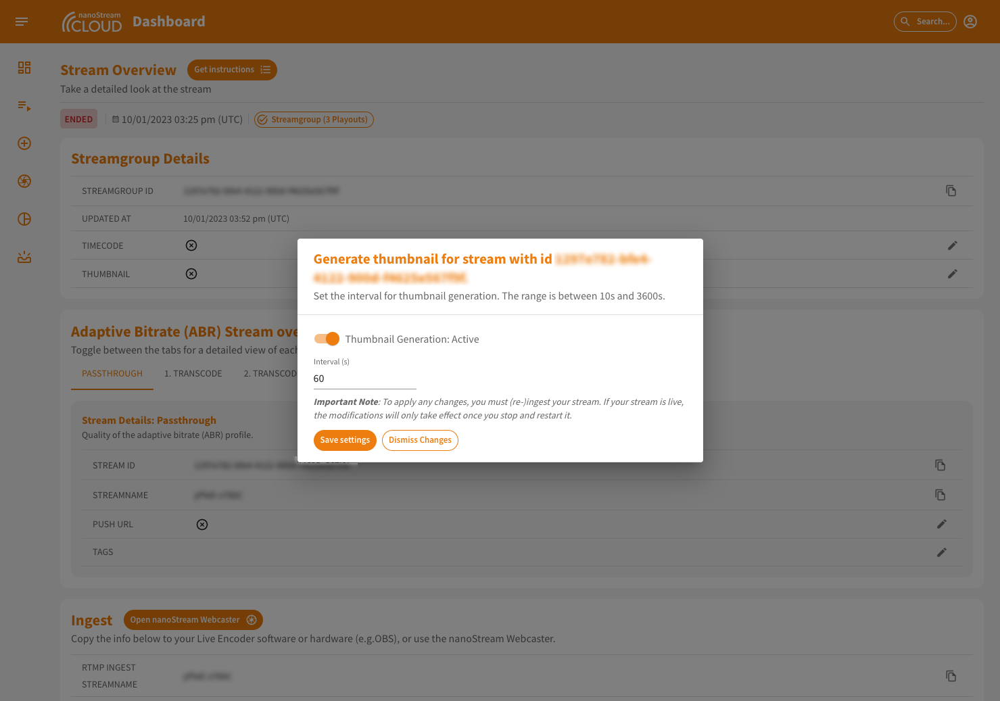

Thumbnails are small-sized preview images used to give viewers a quick snapshot of the content they represent. They open up new use-cases including and not limited to, e.g snapshots of content of interest or poster images for streams. By providing a visual summary, thumbnails enhance user experience and navigation efficiency. 

:::info Before starting
To begin, please sign in using your nanoStream Cloud/Bintu account credentials.  
If you have not created an account yet, you can [sign up](https://dashboard.nanostream.cloud/auth?signup) or reach out to our dedicated sales team via the [contact form](https://www.nanocosmos.de/contact) or by sending an email to sales(at)nanocosmos.de.
:::

## Setting up thumbnails

To activate a thumbnail, you need to navigate to the Stream Overview page of your stream. Within the "Details" section at the top, you can find there the "Thumbnail" flag at the end of the list. By clicking on the "Edit" button located at the end of the row, a dialog to appear.

*Screenshot: Stream Overview incl. Thumbnail Flag*

In this dialog, you can enable the thumbnail generation and select an interval. This can range from 10 to 3600 seconds. The thumbnail will be generated based on the selected interval.

*Screenshot: Thumbnail Activation Dialog*

Upon enabling the thumbnail generation, you'll notice a update in the user interface showcasing the thumbnail. Furthermore, the details list will now include the Thumbnail URL, and the selected interval will be prominently displayed.

*Screenshot: Thumbnail in Stream Overview*

## Updating settings

There may be a need to make changes, such as adjusting the interval or perhaps turning off the thumbnail generation. To facilitate this, the setup dialog can be accessed again. There are two ways to access this dialog:

1. From the details list, locate the row labeled "Thumbnail Interval" and click on the "Edit" button at the end of the row.
2. From the section above the thumbnail preview, click on "Update settings." 

Both buttons will bring up the same dialog where all settings can be updated as needed.

:::danger Important to know
To apply any changes, you must (re-)ingest your stream. If your stream is live, the modifications will only take effect once you stop and restart it.
:::

*Screenshot: Thumbnail Setup Dialog*
