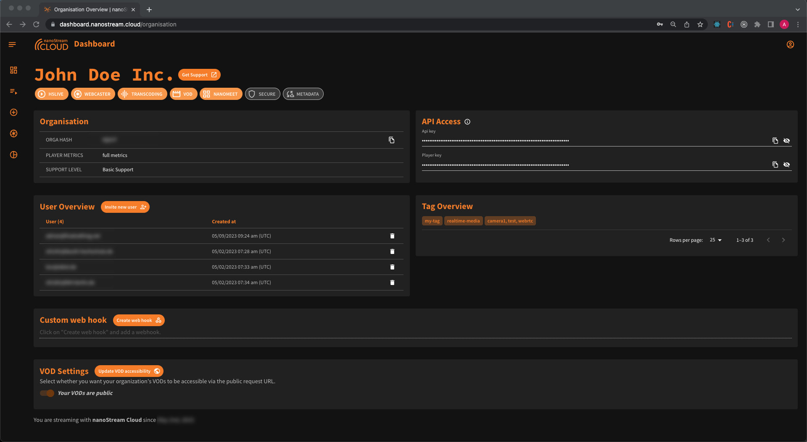
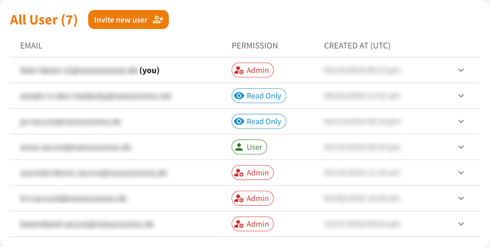
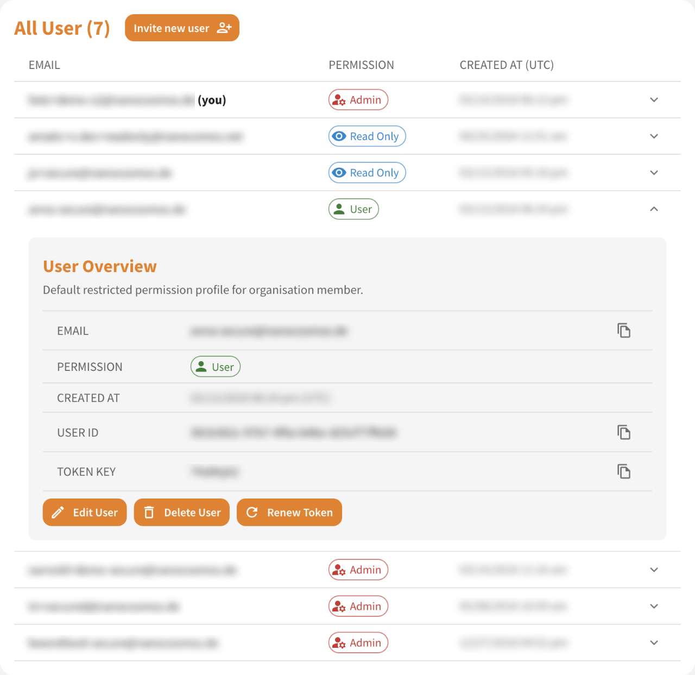
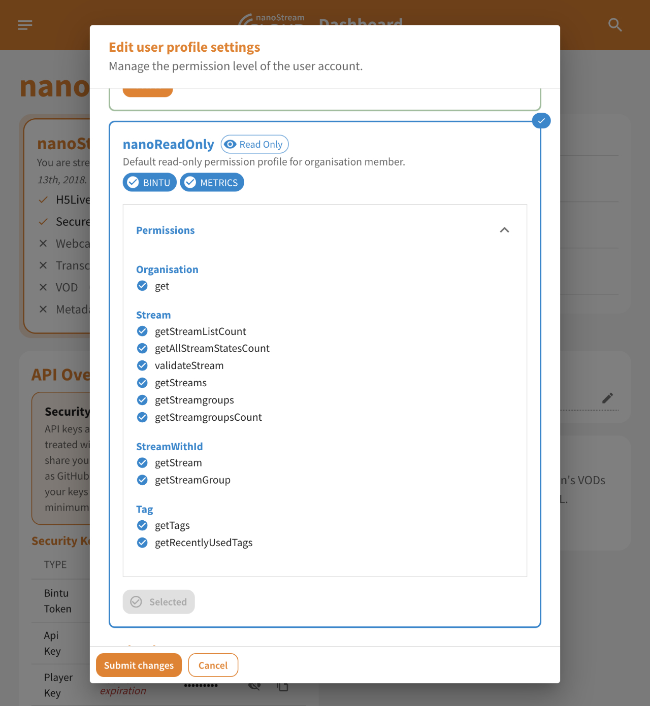

The user section of the nanoStream Cloud Dashboard allows administrators to manage user roles and access tokens efficiently. For a comprehensive overview of all users in your organization, including their current roles and permissions, navigate to the  overview of your organisation. Here, you can view detailed information and perform various management tasks.

> [Click here](https://dashboard.nanostream.cloud/organisation) to see the organisation area.

*Screenshot: Organisation Overview*

## Managing a User

In the User Overview, it is possible to see how many users are part of the organization and their respective roles.

*Screenshot: User Overview*

Clicking on a user expands their details, allowing for the choice between three action options: Edit, Delete, and Renew Token.

*Screenshot: Expanded User in User Overview*

### 1. Edit a User's Role

:::warning Up- / Downgrading an User
Changing a user's role will invalidate any existing tokens for that user. 
> For example, if a user is downgraded from nanoAdmin to nanoReadOnly, they will immediately lose Admin rights, even if still logged in, and will only have the user-role related rights. Consequently, all previous Bintu tokens will become invalid.

#### Secure Organisations
Playback tokens issued by this user remain valid until they reach their expiration date.
:::

After selecting "Edit User" the user's role can be adjusted to one of the three roles: nanoAdmin, nanoUser, and nanoReadOnly.

:::info Good to know
Learn more about Role-Based Access Control (RBAC) in our [documentation](../cloud/user_roles.md). It covers important [security risks](../cloud/user_roles.md#security-risks) associated with improper role assignments and access control, as well as a [detailed descriptions of each user role](../cloud/user_roles.md#user-roles).

It is possible to expand the respective role in the corresponding dialog to get a quick overview of the associated permissions.

*Screenshot: Edit User dialog with expanded readonly permission*
:::

The dialog provides an overview of the options that each role entails. After selecting the appropriate role, confirmation of the choice is required.

*Screenshot: Edit User Dialog with available roles*

Once the selection is confirmed, the user's role will be updated, and they will have the respective rights.

:::warning important to know
Due to caching, it may happen that the dashboard and its user interface is not updated immediately after the change. Nevertheless, the user right level is displayed directly. 

However, it is important to note that **it is not possible to perform actions outside the assigned authorization class**. Despite the delay with which the user interface reflects the changes, the system enforces the updated authorizations and ensures that users cannot exceed the rights assigned to them.
:::

### 2. Delete a User

An admin can delete a user at any time. This action requires double confirmation to ensure it is intentional.

### 3. Renew a Token

Accidental exposure of valid JWT access tokens can give unauthorized individuals access to the organization's resources. To prevent this security risk, a mechanism for *tokenKey* rotation is offered. In the event that a user's JWT access token is exposed or compromised, a nanoAdmin (or an individual with API Key access) can renew the corresponding user's *tokenKey*.

This action effectively invalidates all existing tokens associated with the user's account, preventing further unauthorized access.

After selecting the renew token option, double confirmation is required. A warning will inform of the consequences of this change. If these consequences are accepted, the changes can be committed by hitting the refresh button.