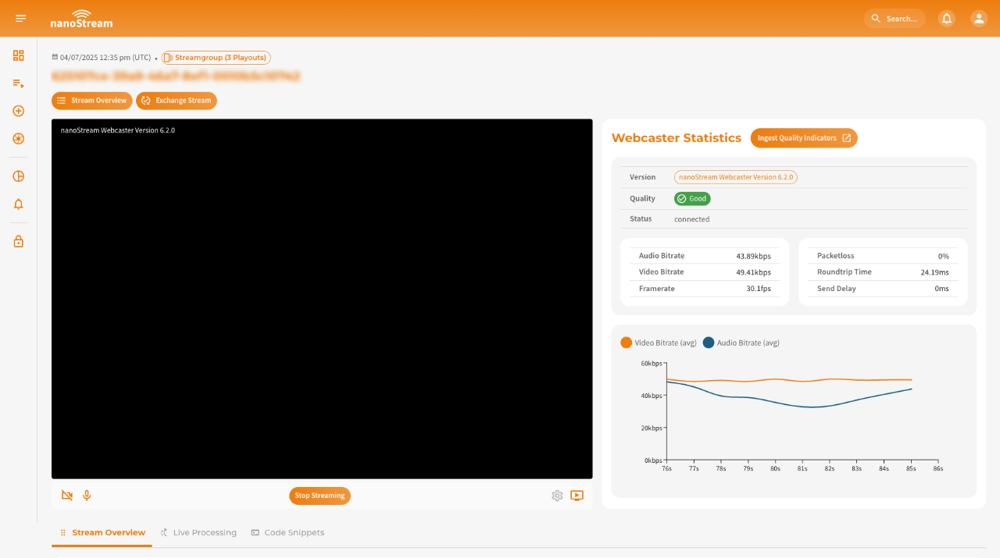

import Tabs from '@theme/Tabs';
import TabItem from '@theme/TabItem';

<Tabs
  defaultValue="obs"
  values={[
    {label: 'OBS Studio', value: 'obs'},
    {label: 'ffmpeg', value: 'ffmpeg'},
    {label: 'nanoStream Webcaster', value: 'webcaster'},
    {label: 'Osprey Talon', value: 'osprey'},
  ]}>
  <TabItem className="tab-item" value="obs">
  
  **OBS Studio** (Open Broadcaster Software) is a free, powerful software for professional live streaming. It allows you to broadcast to **nanoStream Cloud** while giving full control over video quality, bitrate, and encoder settings.
  
  OBS offers **nanoStream Cloud** as a streaming service for automatic setup, making configuration simple and fast.
  
  **Steps:**
  1. Download & Install [OBS Studio](https://obsproject.com/).
  2. Open OBS and go to `Settings → Stream`.
  3. Under **Service**, select `Other… → nanoStream Cloud/bintu`.
  4. Enter the **Stream Key**, known as **Stream name** in nanoStream Cloud Dashboard (e.g., `ABCDE-XYZ12`). 
  5. Configure video source (add source, arrange overlays, etc.)
  6. Start Streaming around the world!
  7. Check your nanoStream Cloud Dashboard to confirm that the live stream is running.

  :::tip Start Streaming
  Learn how to start and share a stream, including the necessary steps and details for a seamless setup [here](/docs/dashboard/start_streaming#start-streaming).
  :::

  -----

  If you need more guidance, read our extended blog post about [Low Latency OBS: How to use OBS for Low Latency Live Encoding to nanoStream Cloud](https://www.nanocosmos.net/blog/how-to-use-obs-for-low-latency-live-encoding-to-nanostream-cloud/).

  <div class="video-wrap">
      <div class="video-container">
          <iframe src="https://www.youtube.com/embed/vkQmMIQJl_4?si=PtzBgA52KC3Su1wA" frameborder="0" allowfullscreen></iframe>
      </div>
  </div>
  *Video Tutorial: Set up OBS with nanoStream Cloud*

  </TabItem>

  <TabItem className="tab-item" value="ffmpeg">

  **ffmpeg** is a free command-line tool that pushes an RTMP stream from a file or capture device to **nanoStream Cloud**, with no GUI required. Use it to send a quick test stream or to automate ingest on a server.

  **Quick start:** replace `<STREAM_KEY>` and run:

  ```bash
  STREAM_KEY=XXXXX-YYYYY ffmpeg -re -i input.mp4 \
    -c:v libx264 -preset veryfast -tune zerolatency -g 50 -b:v 1000k \
    -c:a aac -b:a 128k \
    -f flv rtmp://bintu-stream.nanocosmos.de/live/$STREAM_KEY
  ```

  The `$STREAM_KEY` is the **Stream name** of your stream in the nanoStream Cloud Dashboard (e.g., `ABCDE-XYZ12`), shown in the [stream overview](/docs/dashboard/stream_overview).

  :::tip Encoder settings
  `-g 50` sets a keyframe interval of about 2 seconds at 25 fps. Adjust resolution and bitrate to your content, see the [General Recommendations](/docs/cloud/live_encoding#general-recommendations).
  :::

  </TabItem>

  <TabItem className="tab-item" value="webcaster">
  
  The **nanoStream Webcaster** is a browser-based encoder that requires no installation or plugins. It is ideal for quick broadcasts live streaming setups.

  You can stream directly from your browser by going to [dashboard.nanostream.cloud/webcaster](https://dashboard.nanostream.cloud/webcaster) and creating a new stream or by selecting an existing one. Alternatively, it is possible to manually append the stream ID to the URL at any time, e.g. `dashboard.nanostream.cloud/webcaster/YOUR-STREAM-ID`.

  **Steps:**
  1. Open the Webcaster via Dashboard → *Webcaster*
  2. Select or create a Stream
  3. Choose camera and microphone
  4. Click **Start Broadcast**

  To learn more about how to set up the webcaster and process the stream, simply refer to our dedicated docs: [Ingesting with the nanoStream Webcaster](/docs/dashboard/start_streaming#ingesting-with-the-nanostream-webcaster).

  If you prefer to integrate the nanoStream Webcaster into your own web page, follow our [Webcaster getting started guide](/docs/webrtc/nanostream_webrtc_getting_started).

  
  *Screenshot: nanoStream Webcaster*

  </TabItem>

  <TabItem className="tab-item" value="osprey">
  
  [Osprey Talon](https://www.ospreyvideo.com/) is a professional hardware encoder that allows you to broadcast high-quality, ultra-low-latency streams to **nanoStream Cloud**. This guide walks you through configuring your device for RTMP, SRT, and WHIP ingestion.

  #### Step 1: Login to your Osprey Device
  
  Access your Osprey Talon via a web browser using the device IP. \
  Default credentials: **Username:** `admin` / **Password:** `osprey`
  
  #### Step 2: Select the Upstream Protocol

  Osprey Talon supports multiple protocols for live ingest. nanoStream Cloud supports **RTMP**, **SRT**, and **WHIP**. You can find the appropriate ingest URL and stream name in your **nanoStream Cloud Dashboard** in the [stream overview](/docs/dashboard/stream_overview).
  
  Once logged in, navigate to `Output → Upstream Protocol` to configure the first channel.


  #### a) RTMP

  For the most common setup:
  1. Select `nanocosmos (RTMP)` or `RTMP/RTMPS` in the Protocol dropdown.
  2. In the `Destination URL`, enter your RTMP ingest URL (e.g., `rtmp://bintu-stream.nanocosmos.de/live`).
  3. Enter the **Stream Key**, known as **Stream name** in nanoStream Cloud Dashboard (e.g., `ABCDE-XYZ12`). 

  #### b) SRT
  
  SRT provides reliable streaming over unpredictable networks and can be used as an alternative to RTMP.
  
  1. Select **TS over SRT** as the protocol.
  2. Set **SRT Mode:** `Caller`.
  3. **Destination Address:** `bintu-srt.nanocosmos.de`.
  4. **Port:** `5000`.

  :::tip When to use SRT
  SRT is ideal for low-latency streaming in challenging network conditions, as it handles packet loss and jitter automatically.
  :::
  
  
  #### c) WHIP (WebRTC-based Ingest)
  
  WHIP allows **browser-friendly, ultra-low-latency ingest** via WebRTC.
  1. Select **nanocosmos WHIP** as the protocol.
  2. Enter the **Stream Key**, known as **Stream name** in nanoStream Cloud Dashboard (e.g., `ABCDE-XYZ12`). 
  
  :::tip When to use WHIP
  WHIP is recommended for scenarios where ultra-low latency and direct WebRTC playback are required, such as interactive webinars or live betting.
  :::

  #### Step 3: Video Configuration & Start Your Broadcast
  
  1. Configure the video source, resolution, and encoding settings for your broadcast.
  2. Click `Actions → Start` to begin streaming.
  3. Check your nanoStream Cloud Dashboard to confirm that the live stream is running.

  ------

  If you need more guidance, have a look at our blog post [Tutorial: Osprey Talon and nanoStream Cloud](https://www.nanocosmos.net/blog/osprey-talon-and-nanostream-cloud/).
  
  </TabItem>
</Tabs>
