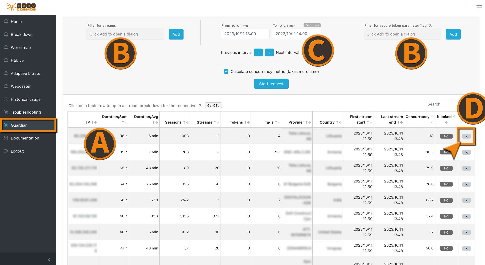
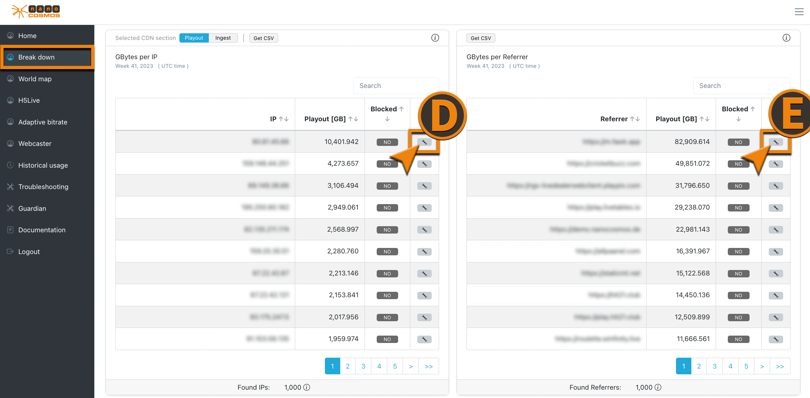

This section describes the Guardian features which can be accessed within the [Analytics Dashboard](https://metrics.nanocosmos.de).

:::tip learn more
Further details and general information about the **nanoStream Guardian** features can be found [here](./guardian).
:::

### Guardian Menu

:::info Before starting
To begin, please sign in to the [Analytics dashboard](https://metrics.nanocosmos.de/login) using your nanoStream Cloud/Bintu account credentials.  
If you have not created an account yet, you can [sign up](https://dashboard.nanostream.cloud/auth?signup) or reach out to our dedicated sales team via the [contact form](https://www.nanocosmos.de/contact) or by sending an email to sales(at)nanocosmos.de.
:::

Once you logged in, click on the Guardian tab to open the Guardian menu.

*Screenshot: Analytics Guardian*

(A) `Data Table` contains specific user properties that were collected for different IPs. (Explanations regarding the different columns can be found directly below the table in the Guardian tab.)

(B) `Filter` to investigate stream related user behavior or streams with [**STS**](../nanoplayer/nanoplayer_feature_security_sts) tag configuration.

(C) `Time Range Filter (UTC Time)` the **start** (From) and **end** (To) of the time range to search in. Adjust this easily by jumping backwards and forwards, using the `-` and `+` buttons. These select the pre- and post- time range depending on the current selected range.

To use referrer blocking as a security measure, you have to switch into the [Breakdown](./analytics#breakdown) tab.

*Screenshot: Guardian Breakdown*

(D) `IP Block Button` that blocks the corresponding IP from stream access.

(E) `Referrer Block Button` that blocks requests from a specific referrer.

### Detailed View

*Screenshot: Guardian Detailed View*

(A) `Data Table` shows detailed information of the selected IP.

(B) `IP Address` of the displayed data.

(C) `List of STS tags` lists your top used STS tags. This can be helpful to specify your investigation.

