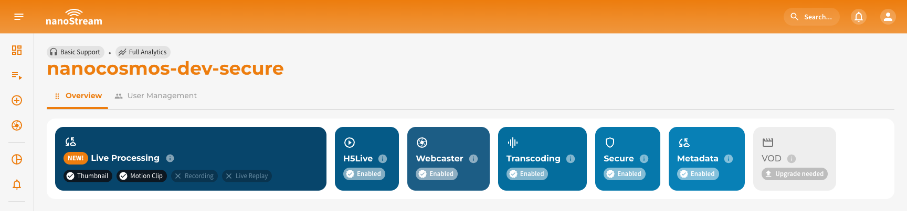

:::warning Prerequisites
To make use of **Live Captions**, it must be explicitly enabled for your organization. Activation may be subject to additional pricing or service terms.

You can verify whether this feature is available by navigating to [dashboard.nanostream.cloud/organisation](https://dashboard.nanostream.cloud/organisation) in your dashboard.  
In the **[Enabled Packages](./organization_overview#enabled-packages)** section, locate the entry for `Live Captions`. If it shows **Upgrade needed**, please [contact us](https://www.nanocosmos.net/contact).

  

To activate `Live Captions` or learn more about available plans, feel free to reach out via [nanocosmos.net/contact](https://www.nanocosmos.net/contact). We're happy to assist you in finding the best setup for your use case.
:::

:::info Live Caption Security Requirements
Live captions are only available for **secure playback**. Therefore, by enabling `live captions`, you will also need to enable the `secure` feature. Please reach out to our sales team via [nanocosmos.net/contact](https://www.nanocosmos.net/contact) or by email at sales(at)nanocosmos.net if you have any questions. \
To learn more about secure playback, visit the dedicated article [Secure Playback (H5Live)](/docs/cloud/security#secure-playback).
:::


## Overview

**Live Captions** convert spoken audio into readable text in real time. This AI-driven feature enhances accessibility and content comprehension across a wide range of live-streaming, especially for:
- Events with spoken content
- Viewers in sound-off environments
- Users who are hard of hearing
- Corporate, educational, or public-facing broadcasts

This provides dynamic, accurate, and easy-to-follow text output that helps viewers stay engaged even without audio. Live captions start automatically as soon as the stream becomes active. The first caption lines typically appear within **5–7 seconds**, depending on the selected **ASR engine**. Captions stop automatically when the stream ends.

To ensure low-latency and reliable delivery, all captions are produced and transmitted through a **dedicated real-time output channel**, separate from the video stream.

:::warning Please note  
Live Captions and the caption switcher are **not included in the default H5Live Player UI**. This means: they are **not embedded automatically**.
To allow viewers to enable, disable, or style captions, your playback environment must integrate caption handling explicitly.
For implementation guidance or UI integration examples, please contact our support team via [nanocosmos.net/support](https://www.nanocosmos.net/support)
:::

## How It Works

During an active stream, the audio is forwarded to the selected **Automatic Speech Recognition (ASR) engine**. The engine converts speech into text and outputs a continuous caption stream. The H5Live Player synchronizes to this caption feed and displays it to viewers in real-time.

:::info Custom set-up for the ASR service
Some of our ASR services require a 24-hour advance notice.
Please contact our sales team via [nanocosmos.net/contact](https://www.nanocosmos.net/contact) to find the best configuration for your business. They will also be happy to give you in-depth advice and recommendations on the ASR types for your use case.
:::

## ASR Engines And Langauges

As already explained earlier, Live Captions rely on **Automatic Speech Recognition (ASR) engines** to convert spoken audio into real-time text. This section explains which ASR providers are available, how they differ, and which languages they support. You will also learn the difference between **source** and **target** languages and how they are applied during live caption generation.

### Supported ASR Engines

import Tabs from '@theme/Tabs';
import TabItem from '@theme/TabItem';

<Tabs
  defaultValue="deepgram"
  values={[
    {label: 'Deepgram', value: 'deepgram'},
  ]}>
  <TabItem className="tab-item" value="deepgram">
  
  **Deepgram** is an enterprise-grade ASR engine designed for high accuracy and very low latency in real-time captioning. It uses neural-network models optimized for live audio and supports multiple languages for both transcription and live translation.
  </TabItem>
    <TabItem className="tab-item" value="whisper">

    **Whisper** is an open-source ASR system developed by OpenAI.
    It offers robust multilingual speech recognition and performs well across diverse audio conditions.
  </TabItem>
</Tabs>

### Supported Languages 

The *source language* is **the spoken language of the incoming audio**. This language is used by the ASR engine to interpret the speech and generate text. The *target language* defines **the output language of the captions**. Only engines that support translation can provide multiple output languages.

:::note Region-specific language codes
Some ASR engines offer region-specific language codes (e.g. **es-419** for *Latin American Spanish*).
Use these variants when **your target audience is primarily from a specific region** and you want **improved recognition of regional accents, vocabulary, and spelling conventions**.

If you do not require a regional focus, the generic language code (e.g. **es**) is typically sufficient.
:::

| Language                    | ID        | Source | Target | Supported Engines |
|-----------------------------|-----------|--------|--------|-------------------|
| Bulgarian                   | bg        | ✓ | ✓ | Deepgram |
| Catalan                     | ca        | ✓ | ✓ | Deepgram |
| Czech                       | cs        | ✓ | ✓ | Deepgram |
| Danish                      | da        | ✓ | ✓ | Deepgram |
| Danish (Denmark)            | da-DK     | ✓ | ✓ | Deepgram |
| Dutch                       | nl        | ✓ | ✓ | Deepgram |
| Flemish (Belgium)           | nl-BE     | ✓ | ✓ | Deepgram |
| English (Generic)           | en        | ✓ | ✓ | Deepgram |
| English (United States)     | en-US     | ✓ | ✓ | Deepgram |
| English (Australia)         | en-AU     | ✓ | ✓ | Deepgram |
| English (United Kingdom)    | en-GB     | ✓ | ✓ | Deepgram |
| English (India)             | en-IN     | ✓ | ✓ | Deepgram |
| English (New Zealand)       | en-NZ     | ✓ | ✓ | Deepgram |
| Estonian                    | et        | ✓ | ✓ | Deepgram |
| Finnish                     | fi        | ✓ | ✓ | Deepgram |
| French (Generic)            | fr        | ✓ | ✓ | Deepgram |
| French (Canada)             | fr-CA     | ✓ | ✓ | Deepgram |
| German (Generic)            | de        | ✓ | ✓ | Deepgram |
| German (Switzerland)        | de-CH     | ✓ | ✓ | Deepgram |
| Greek                       | el        | ✓ | ✓ | Deepgram |
| Hindi                       | hi        | ✓ | ✓ | Deepgram |
| Hungarian                   | hu        | ✓ | ✓ | Deepgram |
| Indonesian                  | id        | ✓ | ✓ | Deepgram |
| Italian                     | it        | ✓ | ✓ | Deepgram |
| Japanese                    | ja        | ✓ | ✓ | Deepgram |
| Korean (Generic)            | ko        | ✓ | ✓ | Deepgram |
| Korean (South Korea)        | ko-KR     | ✓ | ✓ | Deepgram |
| Latvian                     | lv        | ✓ | ✓ | Deepgram |
| Lithuanian                  | lt        | ✓ | ✓ | Deepgram |
| Malay                       | ms        | ✓ | ✓ | Deepgram |
| Norwegian                   | no        | ✓ | ✓ | Deepgram |
| Polish                      | pl        | ✓ | ✓ | Deepgram |
| Portuguese (Generic)        | pt        | ✓ | ✓ | Deepgram |
| Portuguese (Brazil)         | pt-BR     | ✓ | ✓ | Deepgram |
| Portuguese (Portugal)       | pt-PT     | ✓ | ✓ | Deepgram |
| Romanian                    | ro        | ✓ | ✓ | Deepgram |
| Russian                     | ru        | ✓ | ✓ | Deepgram |
| Slovak                      | sk        | ✓ | ✓ | Deepgram |
| Spanish (Generic)           | es        | ✓ | ✓ | Deepgram |
| Spanish (Latin America)     | es-419    | ✓ | ✓ | Deepgram |
| Swedish (Generic)           | sv        | ✓ | ✓ | Deepgram |
| Swedish (Sweden)            | sv-SE     | ✓ | ✓ | Deepgram |
| Turkish                     | tr        | ✓ | ✓ | Deepgram |
| Ukrainian                   | uk        | ✓ | ✓ | Deepgram |
| Vietnamese                  | vi        | ✓ | ✓ | Deepgram |

:::info Multi target translation
Because Deepgram supports translation, any **source language** listed above can be combined with any **target language**.
:::

:::warning Missing a language?
If your desired language is not listed, please get in touch with us via [nanocosmos.net/contact](https://www.nanocosmos.net/contact) or by email at sales(at)nanocosmos.net. \
We can evaluate your use case, discuss engine support, and, where possible, include you in upcoming beta programs for additional languages.
:::

## Managing Live Captions

There are two different ways to integrate live captions into streams: via the nanoStream Cloud Dashboard or directly via the bintu API.

To use captions, you must first create a stream. See the stream creation guides:

<article className="margin-vert--lg">
  <Columns className="list_ZO3j">
    <Card className="col col--6 margin-horiz--md" href="/docs/dashboard/live_captions">
      <Card.Header title="Create Stream via Dashboard" />
      <Card.Body>Use the web-based nanoStream Cloud Dashboard to configure and start streams.</Card.Body>
    </Card>
    <Card className="col col--6 margin-horiz--md" href="https://doc.pages.nanocosmos.de/bintuapi-docs/#operation/Create%20Stream">
      <Card.Header title="Create Stream via API" />
      <Card.Body>Create streams programmatically using the bintu REST API.</Card.Body>
    </Card>
  </Columns>
</article>


### Dashboard Integration

Live Captions can be configured directly through the **nanoStream Dashboard**. \
The workflow during the *Stream Creation* in the UI is designed to be simple and intuitive:

1. Select the **Live Captions engine**.
2. Choose a **source language** (speech input).
3. Choose one or more **target languages** (caption output).
4. Save your configuration.


*Screenshot: Adding live captions during stream creation*

A detailed guide with screenshots on how to manage streams with live captions is available in the [**Live Captions in the Dashboard**](/docs/dashboard/live_captions) documentation.

:::tip Accessing Live Captions Management  
The **Live Captions** configuration can be created, edited, or removed in multiple dashboard locations:

- During stream creation: [dashboard.nanostream.cloud/stream/create](https://dashboard.nanostream.cloud/stream/create)
- Later via the Stream Overview tab **Live Captions** tab, which can be found:
  - **Stream Overview**: [dashboard.nanostream.cloud/stream/YOUR-STREAM-ID/live-captions](https://dashboard.nanostream.cloud/stream/YOUR-STREAM-ID/live-captions)
  - **Playout Overview**: [dashboard.nanostream.cloud/playout/YOUR-STREAM-ID/live-captions](https://dashboard.nanostream.cloud/playout/YOUR-STREAM-ID/live-captions)
  - **Webcaster Overview**: [dashboard.nanostream.cloud/webcaster/YOUR-STREAM-ID](https://dashboard.nanostream.cloud/webcaster/YOUR-STREAM-ID)
:::

:::warning good to know
You can modify live captions settings at any time. **However, it’s important to note that the stream must be re-ingested for the changes to take effect.**
:::

### API Integration

Live Captions are controlled via **Stream Options**, managed through the bintu API.

You can access the requests with the following permission level:

|<span className="role role-admin">nanoAdmin</span>|<span className="role role-user">nanoUser</span>|<span className="role role-readonly">nanoReadOnly</span>|
|---|---|---|
| ✓ | ✓ | ✗ |

**Supported API actions**

- [`POST`](https://doc.pages.nanocosmos.de/bintuapi-docs/#tag/Stream-Options/paths/~1stream~1{id}~1options/post) → Add live captions to a stream
- [`GET`](https://doc.pages.nanocosmos.de/bintuapi-docs/#tag/Stream-Options/paths/~1stream~1{id}~1options/get) → Retrieve current caption settings
- [`PUT`](https://doc.pages.nanocosmos.de/bintuapi-docs/#tag/Stream-Options/paths/~1stream~1{id}~1options/put) → Update existing settings
- [`DELETE`](https://doc.pages.nanocosmos.de/bintuapi-docs/#tag/Stream-Options/paths/~1stream~1{id}~1options/delete) → Remove live captions settings

**Parameters**
- `YOUR_STREAM_ID`: the unique ID of your stream in nanoStream Cloud
- `X-BINTU-APIKEY`: your API key for authentication

:::info Locate your API Key
To find your API key, please sign in to your nanoStream Cloud/Bintu account and copy your API key [here](https://dashboard.nanostream.cloud/organisation).
:::

**Body**
- `NAME`: must always be set to `"captions"` to enable Live Captions for the stream.
- `OPTIONS`: Contains all configuration options for the caption engine, this includes: `engine`, `sourceLanguage`, `targetLanguage` (optional)

```html title="bintu/post_stream_options.sh"
curl --request POST \
  --url https://bintu.nanocosmos.de/stream/%7Bid%7D/options \
  --header 'X-BINTU-APIKEY: REPLACE_WITH_YOUR_API_KEY' \
  --header 'content-type: application/json' \
  --data '{"name":"captions","options":{"engine":"deepgram","sourceLanguage":"en"}}'
```

:::note Live Captions API-First Guide & Advanced bintu API docs
For a complete end-to-end API walkthrough (including authentication, stream creation, caption option configuration, live monitoring, and CDN transcript downloads), see the [**Live Captions API Guide**](/docs/cloud/live_captions_api_guide).

For additional languages, advanced configuration options, and complete request/response schemas, please refer to the official **bintu API documentation**: [doc.pages.nanocosmos.de/bintuapi-docs](https://doc.pages.nanocosmos.de/bintuapi-docs).
:::

## Need assistance?

:::tip Need assistance?
We're here to support you throughout your Live Captions integration.
If you would like to discuss your Live Captions requirements, pricing, or custom solutions, feel free to contact our sales team via [nanocosmos.net/contact](https://www.nanocosmos.net/contact) or by email at sales(at)nanocosmos.net.

*If you require technical help or want to report an issue, simply use our official [support form](https://www.nanocosmos.net/support).*

We're happy to assist you in finding the best configuration for your workflow.
:::
