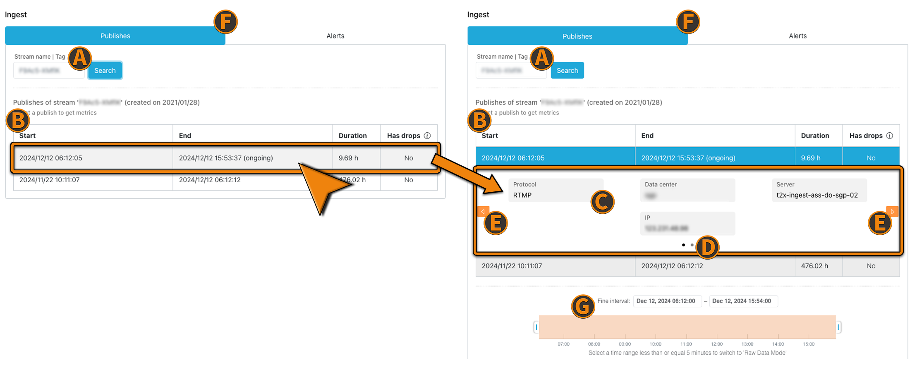
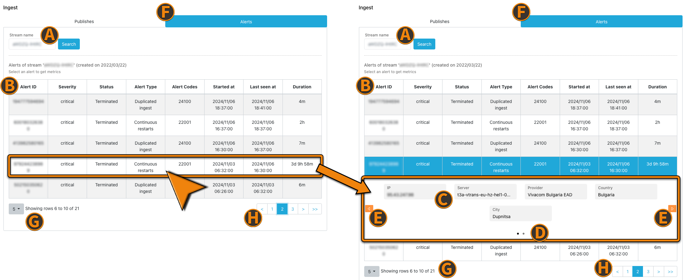
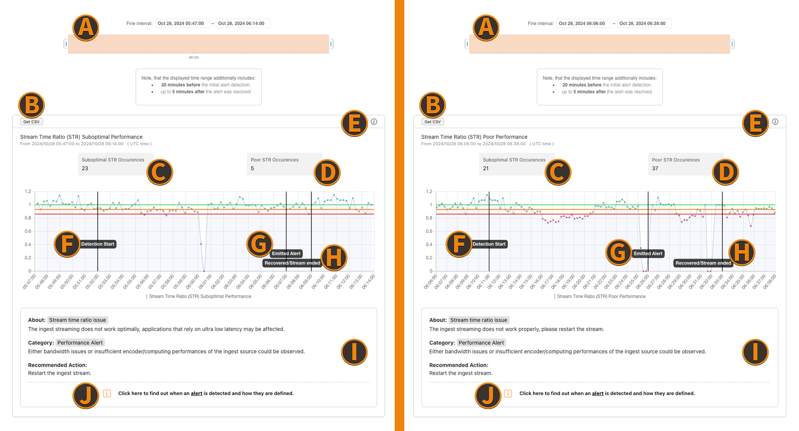
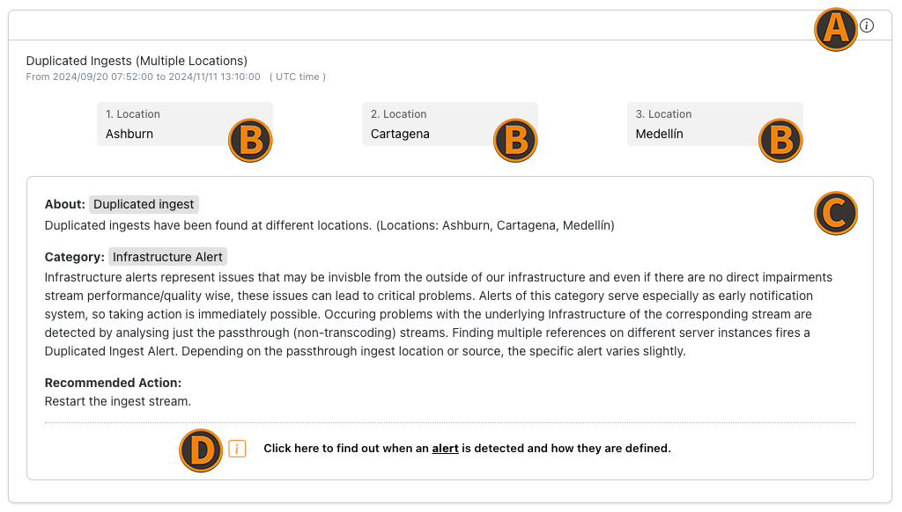

import { ScaledImage } from '../../src/components/global/ScaledImage.js';

The troubleshooting page helps to investigate stream or user specific metrics across the streaming experience from stream ingest to the playout at the enduser. With this feature you have a complete transparent view at your streams, which helps you to find potential problems and be more capable of solving them faster.

:::info Before starting
To begin, please sign in to the [Analytics Dashboard](https://metrics.nanocosmos.de/login) using your nanoStream Cloud/Bintu account credentials.  
If you have not created an account yet, you can [sign up](https://dashboard.nanostream.cloud/auth?signup) or reach out to our dedicated sales team via the [contact form](https://www.nanocosmos.de/contact) or by sending an email to sales(at)nanocosmos.de.
:::
    
## Access

Access to the Trouble Shooting page is available for every nanoStream Cloud customer.

:::info note
Displaying Stream Playout information will require a business upgrade to sent your H5Live Player metrics to our Analytics backend. Please contact sales(at)nanocosmos.de for business details.
:::

## Time Picker

The time picker declares the time period in which you will query for available metric results. Use to " Set to Now" button the to automatically update to the current time.

:::tip note
Date and time values are interpreted as UTC, an offset to your local timezone needs to be considered.
:::

*Screenshot: Time Picker*

## Playouts

After selecting a specific time period you are asked to enter an IP address or an user ID to access playout statistics about all streams that this user retrieved. You will then be able to select one out of the 5 newest playouts based on their start date. To view more than these 5 results you need to adjust the time range accordingly. We also implemented support for currently running playouts.

:::tip note
Only organizations with player metrics option enabled will be able to see the items in this data group.
:::

*Screenshot: Playout Time Picker*

(A) `From (UTC Time)` the **start** of the time range to search in.

(B) `To (UTC Time)` the **end** of the time range to search in.

(C) `By` indicates the time interval granularity. It can be 30 seconds or 1 minute.

(D) `Playout` tab which selects to view playout statistics. Playout statistics for all streams in the selected time period are retrieved.

(E) `End to End` tab which selects to view both playout and ingest statistics in the same page. Playout and ingest statistics for all streams in the selected time period are retrieved.

(F) `Ingest` tab which selects to view ingest statistics. Ingest statistics for all streams in the selected time period are retrieved.

(G) `Copy URL to share` will copy the current page setup to clipboard. Users can send this URL to nanocosmos support for further troubleshooting help.

(H) `IP address/user ID` specifies either the IP address used in client playouts or user IDs to search for related streams.

:::info note
To make this work with user IDs, you have to assign IDs to your users beforehand and also transmit that to the [player API](../nanoplayer/nanoplayer_player_metrics#how-to-use).
:::

(I) `Select a stream` shows all streams that has a playout related to the IP address or user ID set earlier.
    
#### Stream Playout Information

If there are metrics available for the selected IP/ user ID within the stated time period, a list of streams viewed by this user is shown. Select the desired stream name to see a list of all playouts for this stream. After you selected a playout more detailed information are shown. Define the time interval with the slider to zoom into streams with a longer duration or to focus on specific parts of the stream. At this point you can synchronize with the corresponding ingest data of the playout on the right side.

*Screenshot: Playout Stream Information*

(A) `Playouts` of selected stream name.

(B)
- `Start` indicates the start of playout.
- `End` indicates the end of playout.
- `Duration` indicates playback duration.

(C) Groups of meta-data information are shown related to the stream.  
The meta-data includes:
- `User ID` - [user ID](https://docs.nanocosmos.de/docs/nanoplayer/nanoplayer_player_metrics/#how-to-use).
- `IP` - client IP address used for playout.
- `Event ID` - [event ID](https://docs.nanocosmos.de/docs/nanoplayer/nanoplayer_player_metrics/#how-to-use).
- `Custom field 1` - [custom field1](https://docs.nanocosmos.de/docs/nanoplayer/nanoplayer_player_metrics/#how-to-use).
- `Playout ID` - internally generated unique ID.
- `H5Live player version` - version of nanoplayer used.
- `Device` - type of device used.
- `Referrer` - webpage that hosts the nanoPlayer.
- `Country` - location of user.
- `City` - location of user.
- `Resolution width` - width of video stream in pixels.
- `Resolution height` - height of video stream in pixels.
- `OS` - OS used.
- `OS version` - OS version.
- `Browser` - web browser used.
- `Browser version` - browser version.

(D) This tab shows which group of meta-data information is being shown at the moment and how many groups are available.

(E) (F)
Click to switch between meta-data information.

(G)
This time slider can be used to define the time interval, allowing to zoom into streams with a longer duration or to focus on specific parts of the stream.

(H)
`Synchronize ingest` gives the ability to synchronize the currently selected playout with the corresponding ingest data group. In this selection, the playout data group is shown on the left side while the ingest data group is shown on the right side. This is same as selecting the ***End to End*** data group.

:::note Info
If an user reloads the page of a stream, it will be accounted as a new playout. 
:::

:::note info
If you set the visible time range to under 5 minutes, you switch from data aggregation mode into raw data mode. Therefore you will get exact datapoints at the given time. 
:::

*Screenshot: Troubleshooting Raw Data Mode*

#### Visualizations

This area shows charts for various player metrics.

*Screenshot: Playout Media Information*

`Bitrate` [kBits/s]:
The retrieved bitrate on the client side at a specific time. Purple lines symbolize events which are also listed in the Events table.

`Latency` [s]:
The latency from ingest to playout. Purple lines symbolize events which are also listed in the Events table.

`Buffering Totaltime Ratio` [%]:
The ratio between buffer and playback duration. 
   
:::info note
A ratio of 0% means no buffering and a ratio of 100% means no playback was possible.
:::

`Events`:
All events that occurred in the selected playout.

## Ingests

### Publishes

The **Ingest/Publishes** tab selects the ingest data group with all items described in detail next. By either synchronizing the ingest stream from a corresponding playout or entering a valid stream name/tag manually, you will get access to ingest specific data, depending on the used protocol WebRTC or RTMP. You can see which protocol was used in the meta-information section after selecting a publish. Currently running ingests are also supported in this overview and are indicated by `(ongoing)` status within the `End` column.

*Screenshot: Publish Table Pre- & Post- Publish Selection*

(A) `Publish search input field` to enter stream name or stream tag

(B) `Publish table header`
- `Start` indicates the ingest start time.
- `End` indicates the ingest end time.
- `Duration` indicates ingest duration.
- `Has drops` indicates if the ingest was interrupted.

(C) `General stream details` show meta-data information related to the stream
- `Protocol` - streaming protocol used.
- `Data center` - specific data center used for this ingest.
- `Server` - specific server in the data center used.
- `IP` - client IP from which the stream was ingested.
- `Country` - location of client IP.
- `City` - location of client IP.
- `Resolution width` - width of video stream in pixels.
- `Resolution height` - height of video stream in pixels.
- `webcaster ID` - ID of corresponding webcaster instance.

(D) These dot indicators show which group of meta-data information is displayed at the moment and how many groups are available.

(E) Click to switch between meta-data information.

(F) `Ingest tabs` - Choose between alerts & publishes to search for

(G) `Fine interval slider` can be used to define the time interval, allowing to zoom into streams with a longer duration or to focus on specific parts of the stream.

 

#### Stream Time Ratio

The stream time ratio (STR) represents the relation between the elapsed real time and the stream time within an interval of 15 seconds. A constant ratio value of 1 would be ideal - but a small fluctuation is expected. A big fluctuation or deviation from the value 1 indicates issues on the ingest side, for instance caused by a limited bandwidth or high CPU load. The higher the deviation from the value 1, the higher the probability for an increased latency on the playback/viewer side.

<ScaledImage image="str_normal.png" alt="Normal STR Example" widthScaling="50" title="Regular Stream Time Ratio" 
    description="In this example you can see a regular course of the STR metric. If you take a closer look at the beginning of the stream, you will notice an increasement in the first 30 seconds, which is intended behavior and does not generate an alert. Sometimes the ingest stream takes a bit to run stable and little fluctuations are considered as regular conditions." />

<ScaledImage image="str_drops.png" alt="Drop STR Example" widthScaling="50" title="Stream Time Ratio with Drops" 
    description="This example shows some kind of edge case. If the stream time ratio indicates spikes, it can be a hint for possible issues. Nevertheless if the stream does recover quickly enough, there is nothing to worry about. The constant fluctuations are sometimes dipping below 0.9, but will be okay, since the average value will be above this threshold." />

<ScaledImage image="str_fluc_recover.png" alt="Fluctuation STR Example" widthScaling="50" title="Temporary fluctuating Stream Time Ratio" 
    description="In this case you can observe a highly fluctating moment of an ingest stream, which does recover after a while. This is a good example for stream behavior that might generate an alert within the first minutes, but will recover by itself afterwards. The reason behind the fluctuation could be bandwith issues or encoder instability." />

#### Visualizations 

Define the time interval with the slider to zoom into streams with a longer duration or to focus on specific parts of the stream. The results you get for the ingest stream name are also sorted by newest first as for the playouts. Selecting a time period auto-refreshes the statistics below.

 

> **RTMP Ingests**

Ingests using RTMP only provide metrics about video and audio bitrates.

*Screenshot: Troubleshoot Ingest RTMP*

- `Video bitrate` [kBits/s]: Video bitrate of the ingested stream.

- `Audio bitrate` [kBits/s]: Audio bitrate of the ingested stream.

 

> **WebRTC Ingests**

Ingests using Web Real Time Communication are providing additional insights to framerate, encoding and package delivery.

:::info note
To have [WebRTC metric](./analytics#webcaster) data available for the Troubleshooting page, they need to be enabled.
:::

*Screenshot: Troubleshoot Ingest Webcaster* 

- `Video bitrate` [kBits/s]: Video bitrate of the ingested stream.

- `Audio bitrate` [kBits/s]: Audio bitrate of the ingested stream.

- `Framerate` [fps]: Framerate of the ingested stream.

- `Average frame encode time` [ms]: The average time needed to encode one frame of the stream.
   
:::caution Long encode time
Note that a long encode time is an indicator for high encoder workload, which can lead to ingest problems. 
:::

- `Count of packet loss detections`: Amount of WebRTC notifications about lost data packages.

:::caution High count of lost packages
Note, a high count of lost packages at a time can lead to issues with the video representation on the side of the end user.
:::

#### Other Samples

> **Video only ingest workflow**

The figure below shows the graphical representation.
In this scenario, only video bitrate data can be observed, while audio bitrate is not available.
Also, the detected video bitrate is about 1 Mbps and this can be checked against settings on ingest encoder.

*Screenshot: Video Only*

> **Audio only ingest workflow**

The figure below shows the graphical representation.
In this scenario, only audio bitrate data can be observed, while video bitrate is not available.
Similarly, the detected audio bitrate is averaging above 25Kbps and this can be checked against settings on ingest encoder.

*Screenshot: Audio Only Ingest Workflow*

> **Audio/Video ingest workflow in good condition**

The figure below shows the graphical representation.
As can be observed, the average video bitrate is about 1.2Mbps while audio bitrate is about 90Kbps. The video and audio bitrates do not deviate too much from the average over time and will not cause overflow or underflow of buffers.

*Screenshot Audio/Video Ingest Workflow in good condition*

> **Audio/Video ingest workflow with network issues**

The figure below shows the graphical representation.
As can be observed, the average video bitrate is about 2Mbps while audio bitrate is about 150Kbps. Towards the end of the graph as highlighted by the red box, the video and audio bitrates fluctuate by more than 50% of the average. This signifies some issues with the ingest from the encoder to nanocosmos CDN. Some causes of these could be ISP related network degradation or encoding anomalies. If this issue is not rectified quickly, then it will cause overflow or underflow of buffers resulting in buffering, connection issues, etc.

*Screenshot: Audio/Video Ingest workflow with network issues*

### Alerts

Via **Ingests/Alerts** tab you can examine alerted streams and make potential issues visible, identify their causes and get helpful recommendations to solve them. After entering a stream name you able to search for any alert occurences in the past 4 weeks. In the following table you can select any alert to get the basic stream details right away.

*Screenshot: Alert Table Pre- & Post- Alert Selection*

(A) `Alert search input field` to enter stream name 

(B) `Alert table header`
- `Alert ID` - Each alert gets a unique alert ID
- `Severity` - Defines the impact level of the underlying issue
- `Status` - The current alert status
- `Alert type` - The individual alert type
- `Alert codes` - Defines the exact alert kind 
- `Started at` - The point in time when the alert was emitted
- `Last seen at` - The last minute when the alert was active
- `Duration` - The current alert duration from emitting to last seen occurrence

(C) `General stream details`
- `Ingest IP` - The IPv4 address that ingested to the stream name
- `Server` - The server that got the ingested data
- `Provider` - The corresponding regional ISP
- `Country` - The country that was ingested from
- `City` - The city that was ingested from
- `Video Width` - The video resolution width
- `Video Height` - The video resolution height

(D) These dot indicators show which group of meta-data information is displayed at the moment and how many groups are available.

(E) Click to switch between meta-data information.

(F) `Ingest tabs` - Choose between alerts & publishes to search for

(G) `Alerts per page settings`

(H) `Page navigation`

 

<h3>Alert Types</h3>

#### Stream Time Ratio Issue

If a performance alert is selected in the alert table, which is **less than 2 weeks old**, the corresponding performance widget is shown below the alert table, providing crucial insights of the stream time ratio (STR) metric. Depending on how good/bad the values are this widget will show a **suboptimal** or **poor** performance. There is an example of **suboptimal performance on the left** and **poor performance on the right** below.

*Screenshot: Alert Widget STR*

(A) `Fine Interval Slider` - Is used to fine tune the selected time interval within the alert duration (max 2 hours of displayed data at once) 

(B) `CSV data export button` - By clicking you can automatically download a `.csv` file, containing the currently displayed data

(C) `Suboptimal STR Occurences` - Shows the number of data points that are between the orange and red horizontal lines (representing the thresholds)

(D) `Poor STR Occurences` - Shows the number of data points that are below the red horizontal line (representing the threshold)

(E) `Quick Info` - Short conclusion of the underlying issue

(F) `Detection Start` - The beginning point in time that counted for alert emitting later 

(G) `Emitted Alert` - The point in time when the selected alert has been raised initially

(H) `Recovered/Stream Ended` - The point in time when the stream performance recovered from the issue by itself or when the stream ended (currently active alerts do not have this indicator)

(I) `Alert Details Panel` - Containing explanantions and further details of this alert and also provides a recommended action to potentially solve the issue

(J) `Link to Documentation` - References more knowledge about alerts and how to deal with them

 

#### Continuous Restarts

In case a *Continuous Restarts* alert is selected in the alert table, this widget will be shown. It shows the analyzed information that lead to this alert notification.

*Screenshot: Alert Widget CR*

(A) `CSV data export button` - By clicking you can automatically download a `.csv` file, containing the currently displayed data

(B) `Quick Info` - Short conclusion of the underlying issue

(C) `Restart Count` - The counted restarts within the alert's duration

(D) `Analyzed Events` - The amount of events that were analyzed within the alert's duration

(E) `Min Distance` - The minimum distance between 2 restarts in seconds 

(F) `Max Distance` - The maximum distance between 2 restarts in seconds

(G) `Average Distance` - The average distance between 2 restarts in seconds

(H) `Alert Details Panel` - Containing explanantions and further details of this alert and also provides a recommended action to potentially solve the issue

(I) `Link to Documentation` - References more knowledge about alerts and how to deal with them

 

#### Duplicated Ingests

**Duplicated Ingests** alert details are shown within the duplicated ingests widget when such an alert type is selected above. Depending on the determined reason this widget will provide information about different locations, IPv4 addresses, or infrastructures. In the following example multiple ingest connections were found for different locations at the same time for the chosen stream.

*Screenshot: Alert Widget DI*

(A) `Quick Info` - Short conclusion of the underlying issue

(B) `Locations` - List of found locations

(C) `Alert Details Panel` - Containing explanantions and further details of this alert and also provides a recommended action to potentially solve the issue

(D) `Link to Documentation` - References more knowledge about alerts and how to deal with them