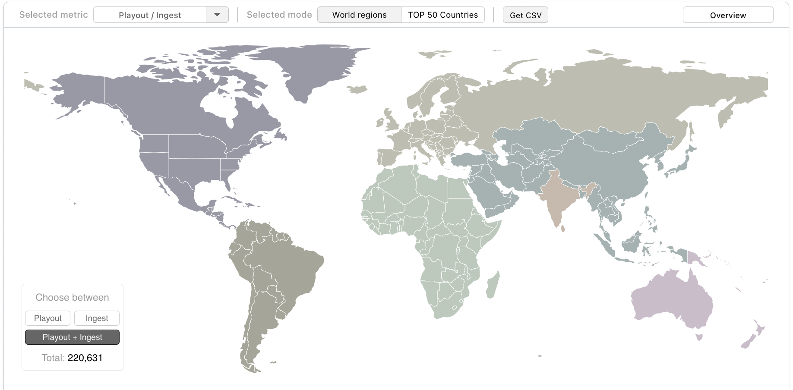
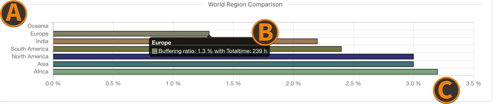
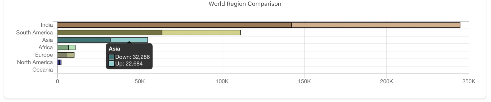

The selected filter options affect all availabe metrics.

:::info Before starting
To begin, please sign in to the [metrics dashboard](https://metrics.nanocosmos.de/login) using your nanoStream Cloud/Bintu account credentials.  
If you have not created an account yet, you can [sign up](https://dashboard.nanostream.cloud/auth?signup) or reach out to our dedicated sales team via the [contact form](https://www.nanocosmos.de/contact) or by sending an email to sales(at)nanocosmos.de.
:::

The world map gives an overview where your customers are located and shows statistics per country.

:::tip special case
The USA (as a special case) are seperated in different regions, where each region counts individually.
:::

You can choose from the following categories:

- **Playout/Ingests**: how many streams where ingested and played back
- **Buffering Play Ratio** (only available with [H5Live metrics](./analytics#h5live) enabled): the ratio between buffer and playback duration over all playouts for a country
  - a ratio of 0% means no buffering
  - a ratio of 100% means no playback was possible
  - for countries like India with a high number of mobile connections and unstable internet connection, a higher buffering/play ratio compared to other countries is expected
- **Latency** (only available with [H5Live metrics](./analytics#h5live) enabled): the average playback latency over all playbacks for a country
- **Playtime average** (only available with [H5Live metrics](./analytics#h5live) enabled): the average playback duration of a playback event, shows how long a viewer will watch a stream
- **Usage** (received/sent): the ingest and playback usage (in gigabytes) for a country
- **ABR playtime**: the playback duration of streams with activated **"adaptive bitrate"** option enabled
- **ABR viewer**: the total viewer count of country/region
- **ABR switches**: the total amount of stream quality level switches for both - "upgrading" and "downgrading"

The area directly below the world map shows either a Top 10 country tabular list for the selected category or a region comparison chart when in **World Regions View**.

## Country View

In the **Country View** you can investigate the TOP 50 countries that apply to your set filter options. These are ranked by the chosen metric, which can be selected right below the View Switch.

*Screenshot: World Map Country View*

(A) `View Switch` lets you change between **Country View** and **World Regions View**.  
(B) `Metric Selection` select a metric category.  
(C) `Metric Subswitch` lets you choose a **sub-metric** if the current selected metric has more than one.  
(D) `Legend` describes the visible metric data in more detail.

## World Regions View

In the **World Regions View** all countries belong to their continental region. The functionalites are basically the same as on **Country View**, but the corresponding data is shown in the **Region Comparison** bar chart below the **Worldmap**.

*Screenshot: World Map: Regions View*

### Regions Comparison

When the **World Regions View** is selected, in this visualization the current selected metric data is shown. The regions are always ranked from "best" to "worst" based on the selected metric.

*Screenshot World Map Region Comparison*

(A) `World Regions` - each of the 7 world regions, classified by our server structure. **(not continents)**  
(B) `Bar Tooltip Description` opens up when hovering over one bar of the chart. It gives more detailed information based on the chosen metric.  
(C) `Metric Unit` is always located at the x-axis and changes accordingly to the selected metric and the corresponding data.  

If a metric consists of **multiple properties**, the bar chart adjusts to a stacked bar chart. Hover over a bar to see more detailed information.

*Screenshot World Map Region Comparison*

### Zoom Region View

Clicking on a region in the **World Regions View**, lets you zoom in and shows country data of all countries within the selected region. The region comparison bar chart also changes to the Top 10 countries ranking of the selected region.

*Screenshot: World Map Region Zoom View*

In **Country View** the Top 50 ranked countries are marked by a small indicator, while in **Zoom Region View** all countries are marked. The Top 10 in both cases is explicitly numerated to give a quick overview of the most popular locations.

(A) `Country` - **Hovering** over the indicator shows country specific details, while **Clicking** opens up a [**Breakdown Menu**](./analytics-zoom#zoom-on-worldmap) of this countrys streaming activity.  
(B) `Country Overview` is shown when hovering over one of the Top 50 ranked countries.
