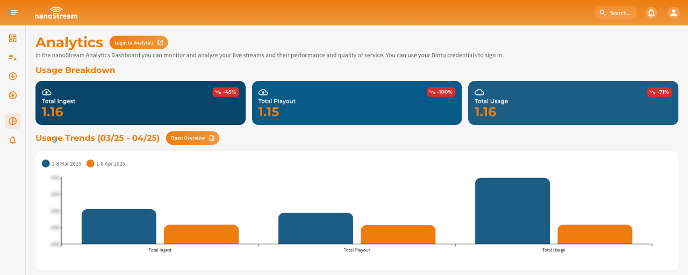
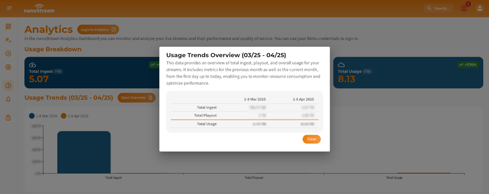
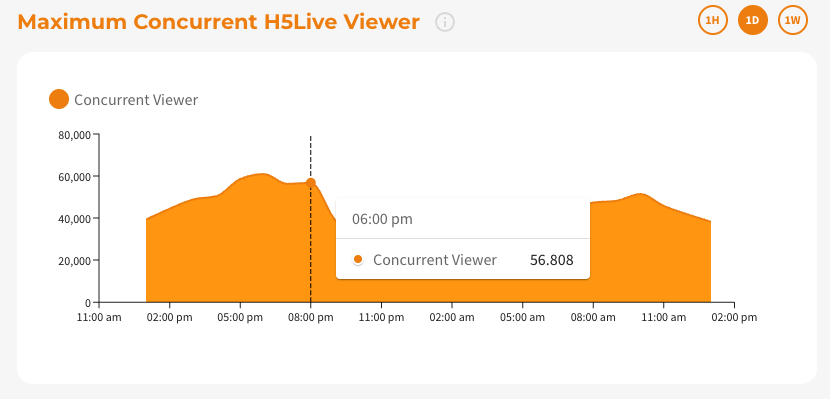
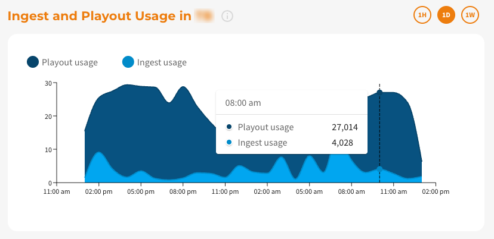

As the digital landscape progresses, real-time monitoring and analytics play a crucial role in ensuring the efficiency and performance of live streams. Integrating nanoStream Analytics API with the nanoStream Dashboard enhances your ability to monitor and analyze live streams in terms of performance and the quality of service.

:::info Before starting
To get started with the **nanoStream Dashboard**, sign in with your existing *nanoStream account*.  
If you don’t have an account yet, you can [sign up](https://dashboard.nanostream.cloud/signup), or get in touch with our sales team via [nanocosmos.de/contact](https://www.nanocosmos.de/contact) or by email at sales(at)nanocosmos.net.

*Need help accessing an existing organization or unsure how to proceed?*  
👉  Check the [Authentication section](./getting_started#authentication) for step-by-step guidance on creating an account, logging in, and requesting access from your system administrator.
:::

## Getting Started

The essence of nanoStream Analytics is to grant you a clear understanding of how your live streams are functioning. It provides insights into the performance metrics and the quality of service of your streams, allowing you to pinpoint issues, make improvements, or even understand the preferences and behaviors of your viewers.

To start, please navigate to [dashboard.nanostream.cloud/analytics](https://dashboard.nanostream.cloud/analytics).

## Usage Breakdown (Month-to-Date)

The **Usage Breakdown** offers a comparative view of your organization’s current month usage versus the previous month. This helps identify trends, assess growth, and support data-driven decision-making.
The usage data is visualized in three primary components: Summary, Usage Trends Chart, Overview Table.

:::tip example
Consider today's date as September 16th.
- Last month, up to August 16th, you generated 300GB of traffic.
- This month, as of September 16th, you've generated 325GB.

Therefore, as of September 16th, your traffic has increased by **8.33%** compared to the same date in the previous month.
:::

*Screenshot: Usage Breakdown (Month-to-Date)*

### 1. Summary

Each container in the summary displays one of the following metrics:

| **Metric**           | **Description** |
|----------------------|-----------------|
| **Total Usage (Month)**   | The sum of all traffic for the current month, including both ingest and playout. This provides an overall snapshot of your stream's resource consumption. |
| **Total Playout (Month)** | The total playout traffic for the current month. Useful for analyzing viewer reach and engagement. |
| **Total Ingest (Month)**  | The total ingest traffic for the current month. Reflects the volume of data being pushed into the system. |

Values are shown with dynamic units (MB, GB, TB, PB), along with the exact figure for the current month up to today.  
A **trend indicator chip** in the top-right corner shows whether the value has increased, decreased, or remained stable compared to the previous month.

### 2. Usage Trends Chart

A bar chart compares the current and previous months:
- **Current month** values are highlighted in **orange**
- **Previous month** values are shown in **blue**

This chart allows for quick visual comparison across days or weeks.

### 3. Overview Table

Clicking on the chart or the **Open Overview** button next to the **Usage Trends** header reveals a detailed table view.
This data provides an overview of total ingest, playout, and overall usage for your streams. It includes metrics for both the current and previous month (from the 1st of each month up to today), enabling you to track resource usage and optimize stream performance.

*Screenshot: Usage Breakdown Overview Table*

:::tip Usage Trends Overview Table
This table and its data is ideal for:
- Taking screenshots
- Easy manual inspection
- External reporting
:::

## Maximum Concurrent H5Live Viewer

This section provides a time series visualization of the **maximum number of concurrent H5Live viewers** for your organization's streams. This chart gives you a clear view of viewer engagement over a selected time frame.
The data is displayed in an interactive line chart.

:::tip your benefit
This feature helps in understanding your audience's behavior, peak viewing times, and helps in forecasting future trends based on past data.
:::

Hovering over the chart will display tooltip data, revealing exact numbers of concurrent viewers and the corresponding time stamp.  
You can filter the time series based on three presets on the top right:

- **Last Hour (1H)**: View concurrent viewer data from the past 60 minutes.
- **Last Day (1D)**: Get insights spanning the previous 24 hours.
- **Last Week (1W)**: Understand viewer trends over the last 7 days.

  
*Screenshot: Maximum Concurrent H5Live Viewer*

## Byte Usage (Ingest / Playout)

The **Byte Usage** section offers a detailed breakdown of the data usage patterns, focusing specifically on ingest (data being sent to the server) and playout (data being broadcasted to viewers) traffic.

The chart provides a dual-layered visual comparison, with separate lines depicting the byte usage for both ingest and playout. This allows you to quickly discern which aspect of your streaming operation is consuming more bandwidth at any given time.

:::info your Benefit
This metric provides a comprehensive look at your streaming infrastructure's efficiency, helping identify potential bottlenecks or areas for optimization in your data handling process.
:::

By hovering over the chart, users can see tooltip data, pinpointing exact byte usage values and their respective timestamps.  
You can filter the time series based on three presets on the top right:

- **Last Hour (1H)**: View concurrent viewer data from the past 60 minutes.
- **Last Day (1D)**: Get insights spanning the previous 24 hours.
- **Last Week (1W)**: Understand viewer trends over the last 7 days.

  
*Screenshot: Byte Usage (Ingest / Playout)*
