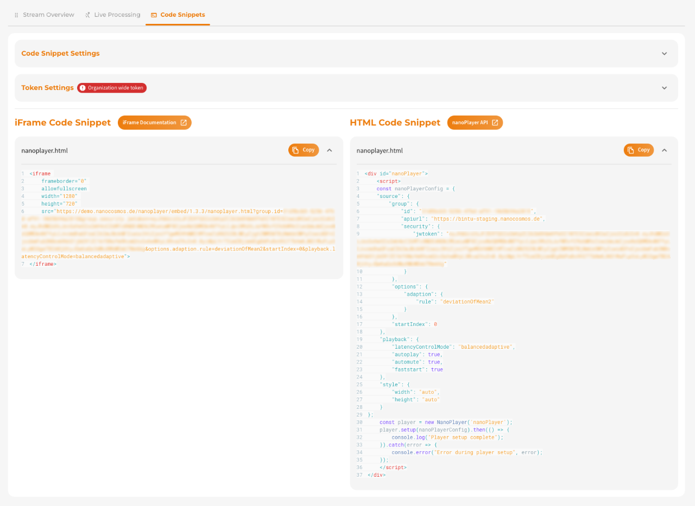
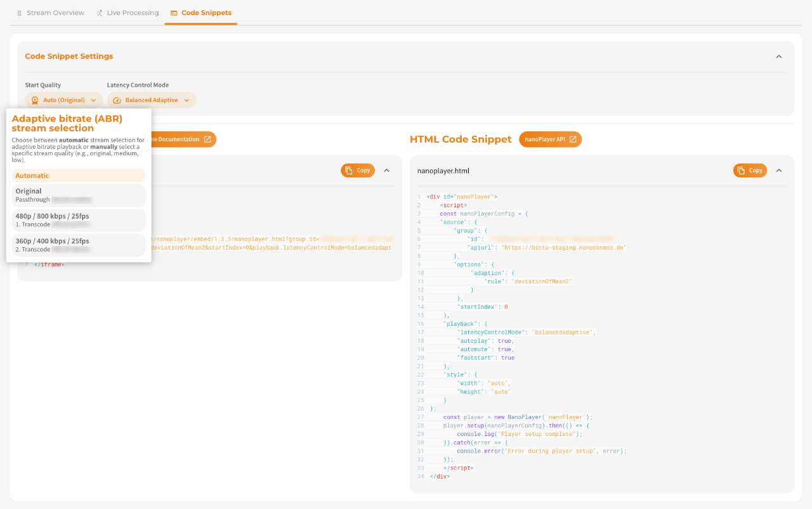
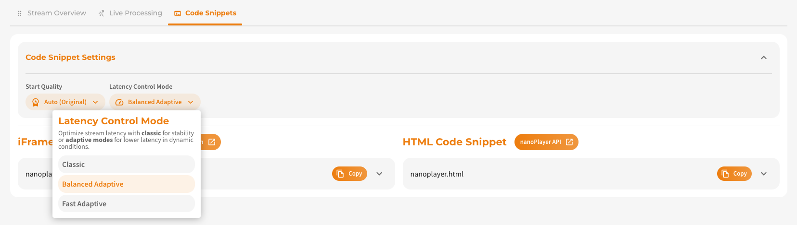
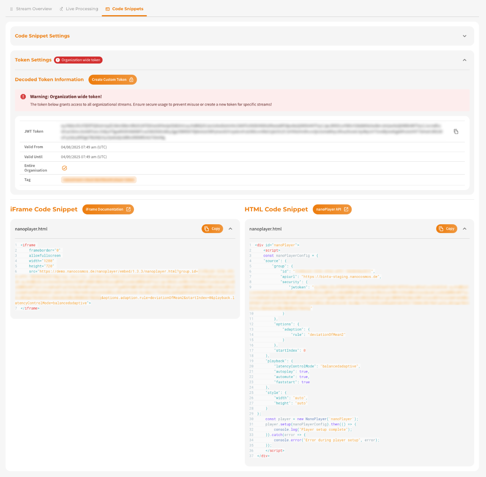

Embedding a live stream into your own website is incredibly simple with nanoStream. Each stream has a unique code snippet that is automatically updated to your setup, requiring you to only copy and paste it into the right place.

You can choose between two types of code snippets for embedding:

- **iFrame Embed Tag** (recommended for quick integration)
- **nanoStream H5Live JavaScript Snippet** (for advanced customizations)

You can find these snippets in multiple locations within the dashboard:

    - dashboard.nanostream.cloud/stream/**YOUR-STREAM-ID**/code-snippets
    - dashboard.nanostream.cloud/stream/new/**YOUR-STREAM-ID**
    - dashboard.nanostream.cloud/playout/**YOUR-STREAM-ID**
    - dashboard.nanostream.cloud/webcaster/**YOUR-STREAM-ID**


*Screenshot: Code Snippets*

## Code Snippet Settings

### Start Quality (Adaptive Bitrate)

For adaptive bitrate (ABR) playback, you can configure the **initial stream quality** that the player should start with.


*Screenshot: Start Quality (ABR) for Code Snippets*

Options include:

- **Automatic Switch** – The player chooses the best stream quality dynamically.
- **Original Quality** – Start with the original (highest) quality.
- **Transcoding Profiles** – Start with a specific lower-resolution stream (e.g., medium, low).

The start quality is only switched automatically if the button specifies this with the addition “Auto”. Otherwise, each switch requires a manual update.

This affects the following parameters in the snippet:

- `options.adaption.rule`
- `startIndex`

### Latency Control Mode

The Latency Control Mode defines how the player handles streaming latency, balancing between stability and speed depending on your requirements and network conditions.


*Screenshot: Latency Control Mode*

This setting affects the `playback.latencyControlMode` parameter in your nanoPlayer code snippet.

You can choose from three modes:


| Mode | Description | Recommended Use Case | Version Notes |
|---|---|---|---|
| `classic`| Well-established, stable default mode. Uses threshold-based buffering. | General use, compatible with custom buffer configs| Default mode, uses `tweaks.buffer` |
| `balancedadaptive`| Adapts latency to stream/network conditions. Lower latency than `classic`. | Mixed environments, iOS supported| v4.14+, iOS support from v4.23     |
| `fastadaptive`| Most aggressive latency control. Achieves the lowest latency. | Real-time use cases, unstable networks, advanced users | v4.14+, avoid `tweaks.buffer`|


:::tip buffer tweaks
`balancedadaptive` and `fastadaptive` should not be used in combination with custom `tweaks.buffer` settings, as they manage buffer values automatically. 

👉 Read more about Buffer Tweaks in our dedicated [H5Live Docs](https://docs.nanocosmos.de/docs/nanoplayer/nanoplayer_feature_latency_control_modes#buffer-tweaks).
:::


## Token Settings

The **Token Setting** section shows your current decoded **JWT (JSON Web Token)** and allows you to configure a **custom access token** for secure stream access.

Token info includes:

- **JWT Token**
- **Valid From / Until**
- **Optional Settings**
- **Token Tag**

:::info Enable secure playback
**nanoStream** provides a `secure` feature to enable secure playback. This feature lets you customize token with settings like expiration date, not-before date, client IP, domain, user ID, or a tag for enhanced security.   
You can verify whether this feature is available for your organization by navigating to [dashboard.nanostream.cloud/organisation](https://dashboard.nanostream.cloud/organisation) in your dashboard. *To enable this feature for your organization, contact us via [nanocosmos.de/contact](https://www.nanocosmos.de/contact)*.
:::


*Screenshot: Token Settings*

## iFrame Embed Tag (nanoPlayer)

A simple `<iframe>` you can drop into any HTML page.

:::tip When to Use the iFrame Embed Tag
- You want a **quick and simple** integration.
- You don’t need to programmatically control or style the player.
- You want to embed the stream in a CMS or no-code platform.
:::

:::warning important
The `allowfullscreen` attribute is required if your site supports fullscreen playback.
:::

```html
<iframe 
    frameborder="0" 
    allowfullscreen 
    width="1280" 
    height="720" 
    src="https://demo.nanocosmos.de/nanoplayer/embed/1.3.3/nanoplayer.html
        ?group.id=YOUR_STREAM_ID
        &group.security.jwtoken=eyJhb....
        &options.adaption.rule=deviationOfMean2
        &startIndex=0
        &playback.latencyControlMode=balancedadaptive"
    >
</iframe>
```

## nanoStream H5Live Code Snippet (nanoPlayer)


Below you can see the **H5Live JavaScript Snippet** HTML code snippet. Ideal for developers who want flexibility and customization.

:::tip When to Use the H5Live JavaScript Snippet
- You want **full control** over the player behavior.
- You need to programmatically change stream sources or handle player events.
- You are building a custom UI or player wrapper.
:::


```html
<div id="nanoPlayer">
    <script>
    const nanoPlayerConfig = {
    "source": {
        "group": {
            "id": "YOUR_STREAM_ID",
            "apiurl": "https://bintu.nanocosmos.de",
        },
        "options": {
            "adaption": {
                "rule": "deviationOfMean2"
            }
        },
        "startIndex": 0
    },
    "playback": {
        "latencyControlMode": "balancedadaptive",
        "autoplay": true,
        "automute": true,
        "faststart": true
    },
    "style": {
        "width": "auto",
        "height": "auto"
    }
};
    const player = new NanoPlayer('nanoPlayer');
    player.setup(nanoPlayerConfig).then(() => {
        console.log("Player setup complete");
    }).catch(error => {
        console.error("Error during player setup", error);
    });
    </script>
</div>
```