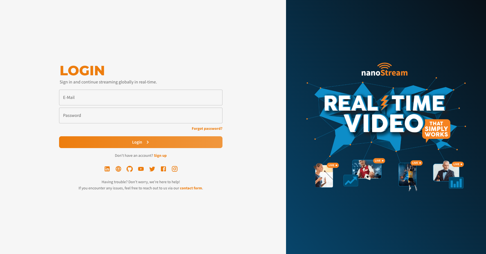
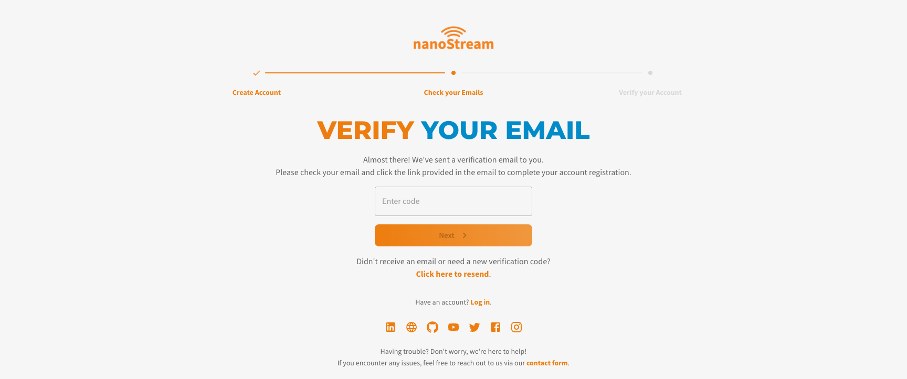
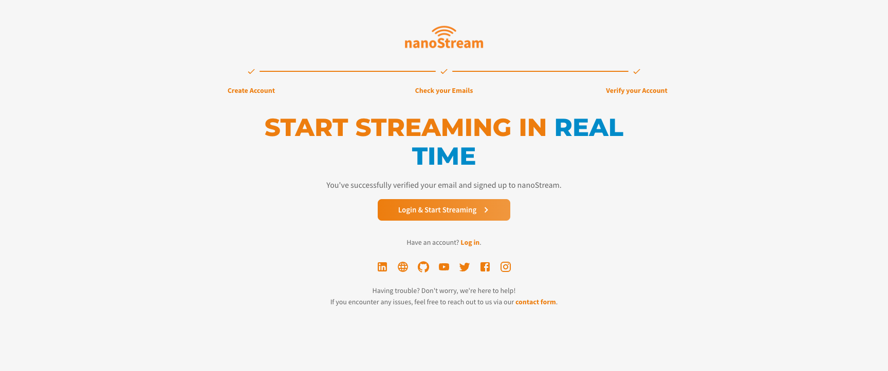
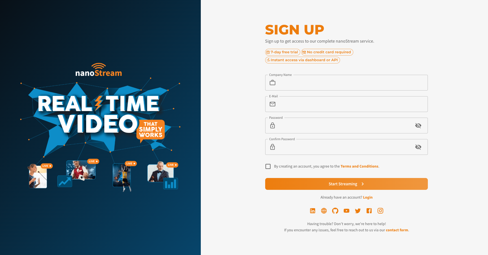
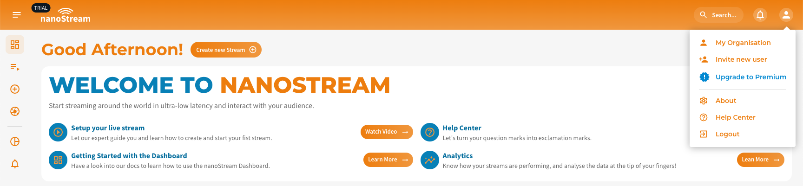

Getting started with nanoStream is a straightforward process. You will need a live source, such as a camera, which can be connected to the nanoStream network (CDN). Our robust platform takes care of efficiently delivering your live stream. To play your live stream on any web browser, you can leverage the power of the [nanoStream H5Live Player (nanoPlayer)](../nanoplayer/nanoplayer_introduction).

To create and broadcast a live stream, it is essential to have a reliable live source. This can include a webcam, external camera, streaming device, or even the screen of your desktop or laptop. In order to send a live stream to the nanoStream Cloud, you will require a Live Encoder. This can be accomplished using industry-standard software like OBS, dedicated hardware encoders, or even a web page equipped with the [nanoStream Webcaster](https://docs.nanocosmos.de/docs/webrtc/nanostream_webrtc_introduction).

Before you can start streaming, you need to authenticate your account. The authentication process depends on whether you already have an account or are new to nanoStream.

## Authentication

To access the nanoStream Dashboard, users must authenticate. There are three ways to do this:
- **[Sign in with an existing account](#sign-in)**
- **[Receive an invite to an existing organization](#invite)**
- **[Sign up for a new account](#sign-up)**.

### Sign In

To log into the nanoStream Dashboard:
1. Navigate to [dashboard.nanostream.cloud/auth](https://dashboard.nanostream.cloud/auth).
    
2. Enter your registered **email** and **password**.
3. Click **Sign In** to access your dashboard and manage your live streaming workflow.

### Invite 

Users can also be invited to an existing organization within the nanoStream. This allows them to collaborate with team members and share streaming resources efficiently.

:::info Invitation Management
Only users with the nanoAdmin role have permission to send invites to new members.  
Learn more about roles and permissions in the [User Management](./user_management.md).
:::

1. If you receive an invitation, click the provided link.
    
2. Enter your **Email**, **Password** and **accept the terms and conditions**.
3. Click on **Start Streaming** to create your account.
4. Verify your account by clicking the verification link sent to your email.
    
5. After verifying your account and logging in, you will automatically become part of the inviting organization with the assigned role set by the inviter.
    

### Sign Up

If you are new to nanoStream, you need to create an account:
1. Visit the [dashboard.nanocosmos.cloud/signup](https://dashboard.nanocosmos.cloud/signup) page.
    
2. Enter your **Company Name**, **Email**, **Password** and **accept the terms and conditions**.
3. Click **Start Streaming** to create your account.
4. Verify your account by clicking the verification link sent to your email.
    
5. Once verified, [log in](#sign-in) to start using the dashboard.
    

### Upgrade to Premium

Upon signing up, you may notice a **Trial Flag** in the dashboard appbar. This indicates that your account is currently in trial mode, which comes with certain limitations.

*Screenshot: Upgrade from trial to premium*

To unlock the full potential of nanoStream, consider upgrading to a premium plan. Simply click the blue **Upgrade to Premium** button within the dashboard menu on the top right.

:::info Upgrade to Premium
Unlock the full potential of the **nanoStream Dashboard** and gain access to all premium features, including advanced analytics, live processing options, and professional support.  
Contact our team via [nanocosmos.de/contact](https://www.nanocosmos.de/contact) to learn more and upgrade your account.
:::

## Next steps

:::info Before starting
To get started with the **nanoStream Dashboard**, sign in with your existing *nanoStream account*.  
If you don’t have an account yet, you can [sign up](https://dashboard.nanostream.cloud/signup), or get in touch with our sales team via [nanocosmos.de/contact](https://www.nanocosmos.de/contact) or by email at sales(at)nanocosmos.net.

*Need help accessing an existing organization or unsure how to proceed?*  
👉  Check the [Authentication section](#authentication) for step-by-step guidance on creating an account, logging in, and requesting access from your system administrator.
:::

<article class="margin-top--lg">
    <section class="row list_ZO3j">
        <article class="col col--4 margin-bottom--lg">
            <a class="card padding--lg cardContainer_Uewx" href="./start_streaming">
                <h2>Start streaming</h2>
                
How to Begin Your First Live Stream

            </a>
        </article>
        <article class="col col--4 margin-bottom--lg">
            <a class="card padding--lg cardContainer_Uewx" href="./stream_overview">
                <h2>Stream Overview</h2>
                
Understanding and Interpreting Your Stream Data

            </a>
        </article>
        <article class="col col--4 margin-bottom--lg">
            <a class="card padding--lg cardContainer_Uewx" href="./abr_transcoding">
                <h2>Adaptive Bitrate</h2>
                
How to Optimize Streaming Quality with ABR

            </a>
        </article>
    </section>
</article>
