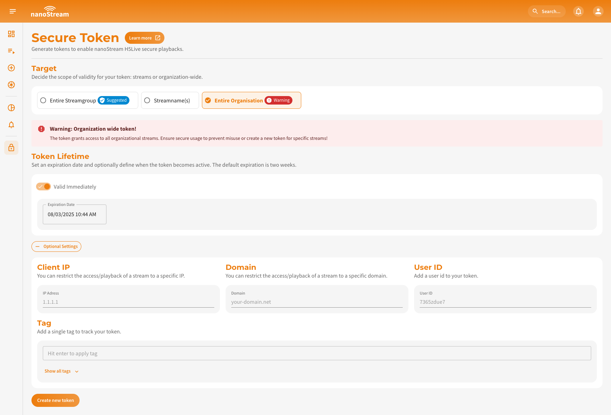

Secure Playback Tokens are a valuable tool that enhances the security of your streams by providing controlled access. With these tokens, you have the ability to decide who can play back your stream, ensuring that only authorized viewers can access your content. The regular playout URL alone will not grant playback privileges.

:::info Prerequisites
To make use of the `secure` feature, it must be explicitly enabled for your organization. Activation may be subject to additional pricing or service terms.

You can verify whether this feature is available by navigating to [dashboard.nanostream.cloud/organisation](https://dashboard.nanostream.cloud/organisation) in your dashboard.  
In the **[Enabled Packages](./organization_overview#enabled-packages)** section, locate the entry for `secure`. If it shows **Upgrade needed**, please contact us.

  

To activate this feature or learn more about available plans, feel free to reach out via [nanocosmos.de/contact](https://www.nanocosmos.de/contact). We're happy to assist you in finding the best setup for your use case.
:::

:::tip Before starting
To begin, please sign in using your nanoStream account credentials. <br/>
If you have not created an account yet, you can [dashboard.nanostream.cloud/signup](https://dashboard.nanostream.cloud/signup) or reach out to our dedicated sales team via the [nanocosmos.de/contact](https://www.nanocosmos.de/contact) or by sending an email to sales(at)nanocosmos.net. <br/>
*If you are unsure how to create an account or need access to an existing organization, please refer to the [Authentication section](./getting_started.md#authentication). There, you will find instructions on signing up, logging in, or requesting an invitation from your system administrator.*
:::


## Token Configuration

One way to create a secure token for your stream(s) or organisation is to navigate to the left-hand menu and select the lock icon. This will take you to [dashboard.nanostream.cloud/secure/token](https://dashboard.nanostream.cloud/secure/token) where you can provide necessary information to generate the token. You can also find this dialog in different sections of the nanoStream Cloud dashboard (e.g., [Code Snippets](./code_snippets), [Stream Overview](./stream_overview)).


*Screenshot: Create Secure Token*

### Required Information

1. **Target**: Choose the target of the token.
   - **Entire Streamgroup** The entire stream group by providing the stream ID
   - **Streamname(s)** specify multiple stream names or
   - **Entire Organization** select the entire organization
2. **Token Lifetime**: The default expiration date is set to 2 weeks, but you can choose any duration you prefer.

### Optional Settings

1. **Not Before Date** (optional): Set the "not before" date to ensure that the token is not valid before a specific date.
2. **Client IP** (optional): Restrict access to streams to a specific client IP address.
3. **Domain** (optional): Restrict the stream to a specific domain.
4. **UserID** (optional): Add a user ID to your token for identification purposes.
5. **Tag** (optional): Add a single tag to track your token.

By providing the required information and optionally configuring specific options, you can generate a token that meets your security requirements by clicking on **Create new token**. It is important to manage and safeguard your tokens to ensure the secure playback of your streams.

### Secure Token Overview

Once you clicked on the **Create new token** button, you will be redirected to an overview page displaying the decoded details of the token you just created. This overview will include all the specifications you set up, such as the token target, expiration date, and any optional configurations you specified.


*Screenshot: Secure Token Overview*

Additionally, you will receive a security config object that you can copy. This object can be pasted into either the group object or the entries element of your player configuration.

```js
security: {
	jwtoken: "YOUR_TOKEN_FOR_YOUR_STREAM"
}
```

## Token Creation Dialog

In addition to the **Secure Toke** creation page, you can also find the decoded token information and create new tokens within specific sections of the nanoStream dashboard. 

You can find the inline token creation dialog in multiple locations within the dashboard:

    - dashboard.nanostream.cloud/playout/**YOUR-STREAM-ID**
    - dashboard.nanostream.cloud/stream/**YOUR-STREAM-ID**
    - dashboard.nanostream.cloud/stream/**YOUR-STREAM-ID**/code-snippets
    - dashboard.nanostream.cloud/stream/new/**YOUR-STREAM-ID**
    - dashboard.nanostream.cloud/webcaster/**YOUR-STREAM-ID**
