The [dashboard.nanostream.cloud/stream](https://dashboard.nanostream.cloud/stream) page provides a comprehensive list of all your streams, displaying their state (`created`, `live`, `ended`), **stream ID**, **stream name**, whether they are part of a **streamgroup**, and their **last update timestamp (UTC)**. Additionally, the pesence of **tags** allows for easier stream identification.    
If a stream is an ABR stream, it belongs to a so-called **streamgroup**. You can collapse the row and view the individual streams within this specific streamgroup, such as passthrough, *n* transcodes.

:::info Before starting
To get started with the **nanoStream Dashboard**, sign in with your existing *nanoStream account*.  
If you don’t have an account yet, you can [sign up](https://dashboard.nanostream.cloud/signup), or get in touch with our sales team via [nanocosmos.de/contact](https://www.nanocosmos.de/contact) or by email at sales(at)nanocosmos.net.

*Need help accessing an existing organization or unsure how to proceed?*  
👉  Check the [Authentication section](./getting_started#authentication) for step-by-step guidance on creating an account, logging in, and requesting access from your system administrator.
:::

### Stream List Overview

The table below provides an overview of the key attributes in the stream list:

- **Stream State**: This column indicates the current state of each stream.
   - `created`: The stream has been created, but never been live
   - `live`: The stream is live right now
   - `deleted`: The stream was live and is not outputting footage anymore.
   - `locked`: The stream was live and has been locked.
- **Stream ID**: The column displays the unique identifier of each stream. If the stream is an [ABR](./abr_transcoding.md) stream it is also the streamgroup id.
- **Stream name**: The streamname („XXXXX-YYYYY“) shows the organisation hash and the unique stream name assigned to each stream.
- **Streamgroup**: Indicates whether the stream is an Adaptive Bitrate (ABR) stream. It shows the number of playouts for ABR streams, e.g. Streamgroup (*n* Playouts), and for non-ABR streams, it displays Single Stream.
- **Last Updated**: Timestamp of the most recent update or modification to the stream.
- **Tags**: Assigned tags or labels for categorizing and identifying streams.

At the bottom of this page, you can find the pagination, where you can decide how many streams (25, 50, 100, 150) you want to per page.

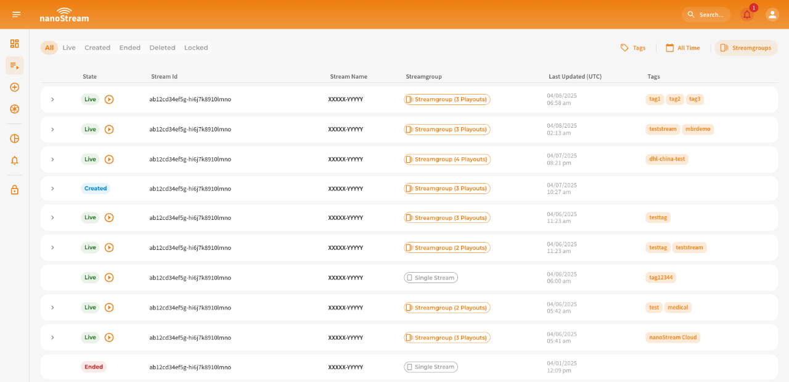
*Screenshot: Stream list*
   
### Filter & Search

At the top of the [dashboard.nanostream.cloud/stream](https://dashboard.nanostream.cloud/stream) page, you’ll find filters to help you quickly locate specific streams. The available filtering options include:

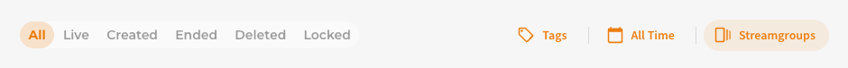
*Screenshot: Streamlist Filter*

- **State**: Filter streams by their state. This includes both standard states (`live`, `created`, `ended`, `locked`) and additional state(s) (`deleted`) that are not visible in the regular stream list. Selecting `all` will only include `live`, `created`, `ended` and `locked`.
- **Tags**: The tag filter allows you to look for streams based on specific tags. You can either manually type in the desired tag or choose from the existing tags that you have previously used. As you start typing at least 3 characters, the system will suggest tags that match the entered characters. To apply a tag, simply hit the "Enter" key after typing it.
- **Date**: Filter streams by date range: Today, Yesterday, This Week, This Month, Past Month, Last 3 Months.
- **Streamgroups**: Choose whether ABR stream groups should be displayed as a single entry or as individual streams. When this filter is enabled, all streams within a group appear separately. If disabled, they remain grouped, but each stream still shows its streamgroup id.

:::tip Search Streams
If you want to search for a specific stream based on its Stream ID or streamname, you can use the search field in the top app bar that is available on every page. Please note the following:

- A valid nanoStream Stream ID or streamname is required. There are no suggestions made.
- A valid nanoStream streamname must follow this format: 'XXXXX-YYYYY'.
- The search is case-sensitive. For example, "AA" is not the same as "aa".
:::

## Single Stream Overview

The Stream Overview section provides a structured, tab-based interface that consolidates all essential details about an individual stream. It offers insights into the stream's configuration, playback status, and processing options.

*Screenshot: Example Stream Overview (Streamgroup)*

This page serves as a central hub where you can:
- Access key metadata, including streaming URLs and (if enabled) security tokens.
- Monitor the stream's state, creation date, and whether it belongs to a single stream or an ABR stream group.
- Perform quick actions such as starting the [nanoStream Webcaster](./start_streaming#ingesting-with-the-nanostream-webcaster), watching the stream, retrieving instructions, or —if permitted— stopping, locking, or deleting the stream.

Each Stream Overview consists of three main elements, which ensures clarity, easy access to key actions, and a streamlined workflow for managing streams efficiently.

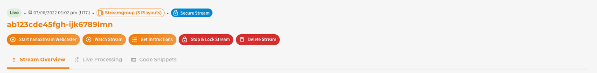
*Screenshot:  Stream Overview Header*

1. **Header** (Visible across all tabs, f.l.t.r.)
 - Stream State
 - Stream Creation Date
 - ABR Stream (Streamgroup (*n* Playouts) or Single Stream)
 - Indicator if the stream is secure (if security features are enabled)
 - Stream ID

2. **Quick Action Buttons** (Visible across all tabs, f.l.t.r.)
 - Start [nanoStream Webcaster](./start_streaming#ingesting-with-the-nanostream-webcaster)
 - Watch Stream
 - [Get Instructions](./start_streaming#start-streaming)
 - Stop & Lock Stream (only if the stream is live and the user has the necessary permissions)
 - Delete Stream (only if the user has the necessary permissions)

3. **Tabs for Detailed Management**
 - **[Stream Overview](#stream-overview)** – General information about the stream
 - **[Live Processing](#live-processing)** – Configuration of live processing features
 - **[Code Snippets](#code-snippets)** – Ready-to-use implementation snippets

### Stream Overview

The Stream Overview UI changes depending on the stream-type:
- **Single Stream** → *Stream Details* (Single Stream)  
 
- **Adaptive Bitrate (ABR) Stream** → *Streamgroup Details* (Streamgroup (*n* Playouts))
 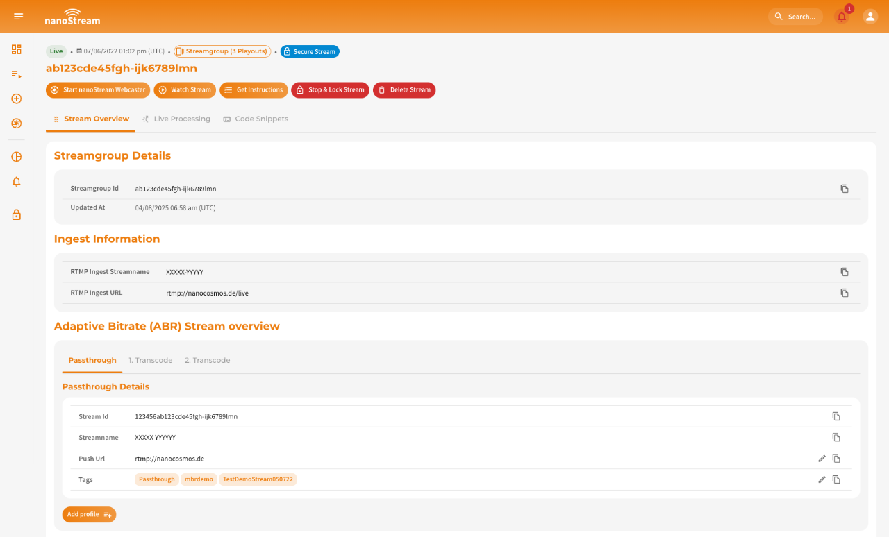

:::info Learn more about Adaptive Bitrate
Adaptive Bitrate (ABR) ensures seamless playback quality, even under unstable network conditions. It switches between multiple stream qualities depending on the viewer’s bandwidth.

👉 Dive into the [Adaptive Bitrate and Transcoding section](./abr_transcoding) to understand how it works and when to use it.
:::

#### Stream(group) Details

For streams with Adaptive Bitrate enabled, the Stream(group) details section is more compact than the single stream view.

| Label         | Single Stream | Streamgroup (*n* Playouts) |
|--------------------|--------------|-------------------|
| **Streamgroup ID** | ✅            | ✅               |
| **Updated At**     | ✅            | ✅               |
| **Timecode**     | ✅            | ✅               |
| **Timecode Interval**     | ✅            | ✅               |
| **Tags**¹  | ✅ | ❌² |
| **Push URL**¹  | ✅ | ❌² | 

¹Editable depending on access level    
²Information can be found in the [Streamgroup Details](#streamgroup-details-streamgroup-n-playouts) section

#### Ingest Information

These details are required to start a stream. To copy the information easily, click the copy icon next to the relevant entry. If you need guidance on starting a stream, refer to the [Start Streaming](./start_streaming.md#start-streaming) section.

- RTMP Ingest Streamname
- RTMP Ingest URL 

*Screenshot: Ingest Information*

#### Adaptive Bitrate (ABR) Stream Overview  Streamgroup (*n* Playouts)

For ABR-enabled streams, this additional section breaks down the streams in the stream group. The streams are categorized as:
- Passthrough (original stream)
- Transcoded Streams (*n* profiles)

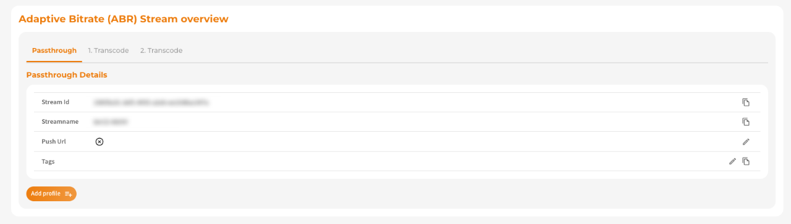
*Screenshot: Adaptive Bitrate (ABR) Stream Overview*

Each stream is listed in a details table, with an **Add Profile** button available (depending on access level and organization limits).

| **Passthrough Stream** | **Transcoded Stream** (*n*th Profile)¹ |
|----------------------|-----------------------------------|
| **Streamgroup ID**   | **Streamgroup ID**   |
| **Streamname**       | **Streamname**       |
| **Push URL**¹  | **Push URL**¹  |
| **Tags**¹  | **Tags**¹  |
| **Tags**¹ | **Tags**¹ |
| ❌ (Original Stream) | **Resolution, Bitrate, Framerate** |

¹Editable depending on access level

#### Secure Playback Token

If your organization has enabled the secure streaming feature, this section displays your decoded logged-in session token information:

- **JWT Token**
- **Valid From / Until**
- **Optional Settings**
- **Token Tag**

When sharing the live playout URL, this token is applied, ensuring transparency regarding its usage.

:::info Enable secure playback
**nanoStream** provides a `secure` feature to enable secure playback. This feature lets you customize token with settings like expiration date, not-before date, client IP, domain, user ID, or a tag for enhanced security.   
You can verify whether this feature is available for your organization by navigating to [dashboard.nanostream.cloud/organisation](https://dashboard.nanostream.cloud/organisation) in your dashboard. *To enable this feature for your organization, contact us via [nanocosmos.de/contact](https://www.nanocosmos.de/contact)*.
:::

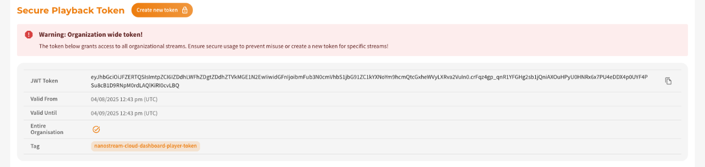
*Screenshot: Secure Playback Token Section in Stream Overview*

#### H5Live Playout
View the live playout URL for real-time streaming:
- Live Playout URL
- iFrame Embed URL
For details on embedding and customizing the iFrame, see the [Code Snippets](#code-snippets) section.

#### VOD Playout URLs

If your organization has enabled the `vod` feature, VOD recordings will be listed here. They are sorted by session and include:
- Session Date (UTC)
- Recording Name
- File Size

### Live Processing

If your organization has enabled `live processing` features, their assets will be listed here.  
To display them, select the desired feature from the **submenu** under the tabs. As shown in the screenshot, the currently selected process is highlighted in light orange. Clicking on a process reveals its associated details below.  

:::tip Prerequisites
To make use of `live processing`, the feature must be explicitly enabled for your organization. Activation may be subject to additional pricing or service terms.

You can verify whether this feature is available by navigating to [dashboard.nanostream.cloud/organisation](https://dashboard.nanostream.cloud/organisation) in your dashboard.  
In the **[Enabled Packages](./organization_overview#enabled-packages)** section, locate the entry for `live processing`. If it shows **Upgrade needed**, please contact us.

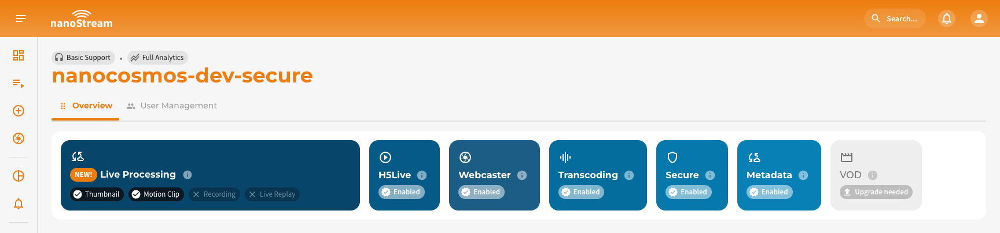  

To activate this feature or learn more about available plans, feel free to reach out via [nanocosmos.de/contact](https://www.nanocosmos.de/contact). We're happy to assist you in finding the best setup for your use case.
:::

Assets for each process are displayed in a **tab-based structure**, depending on whether they belong to an **ABR stream** ( Streamgroup (*n* Playouts)) or a **single stream** (Single Stream). Users can switch between different quality levels for ABR streams, while single streams have only one quality level available.  

#### Thumbnails and/or Motion Clips 
In the title row, you can press the **Refresh** button to update the thumbnail. Similarly, you can modify settings, depending on access level. The refresh button is useful because the stream overview does not update dynamically. Since thumbnails or motion clips change based on the interval/duration settings, this button allows users to reload the latest updates.  

Thumbnail- and motion clip-related information include:  

- **Process status** (active/inactive)  
- **Streamname**  
- **Asset quality**
- **URL to the asset on our servers**
- **Interval** (in seconds)  

For motion clips, the **Duration** of the generated assets is also displayed.  

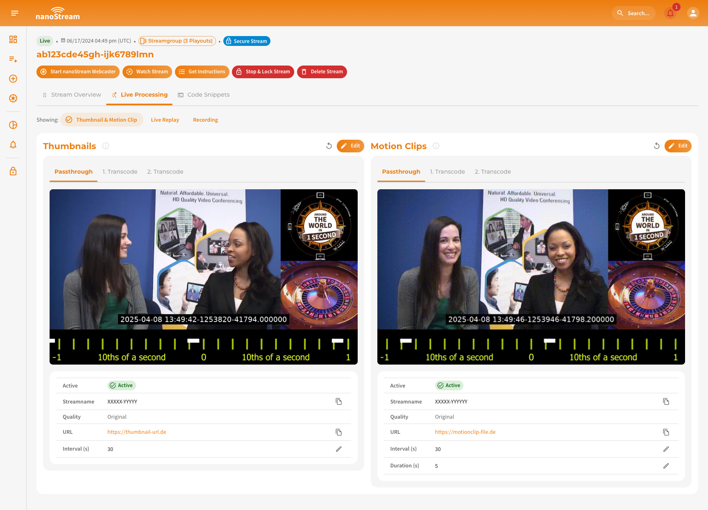
*Screenshot: Thumbnail & Motion Clip Overview*

#### Live replay

The **Live Replay** details includes:  

- **Process status** (active/inactive)  
- **Streamname**  
- **Asset quality**
- **URL to the asset on our servers**
- **Duration** (in seconds) or whether it applies to the entire stream  

Replay files and access details are listed below and categorized as follows:  

- **Session Date (UTC)**  
- **HLS File**  
- **Replay Access**  
- **Clip & Share Access**  

:::warning Note
URLs always belong to their respective streams. For **ABR streams**, the URLs are grouped accordingly and listed separately.
:::

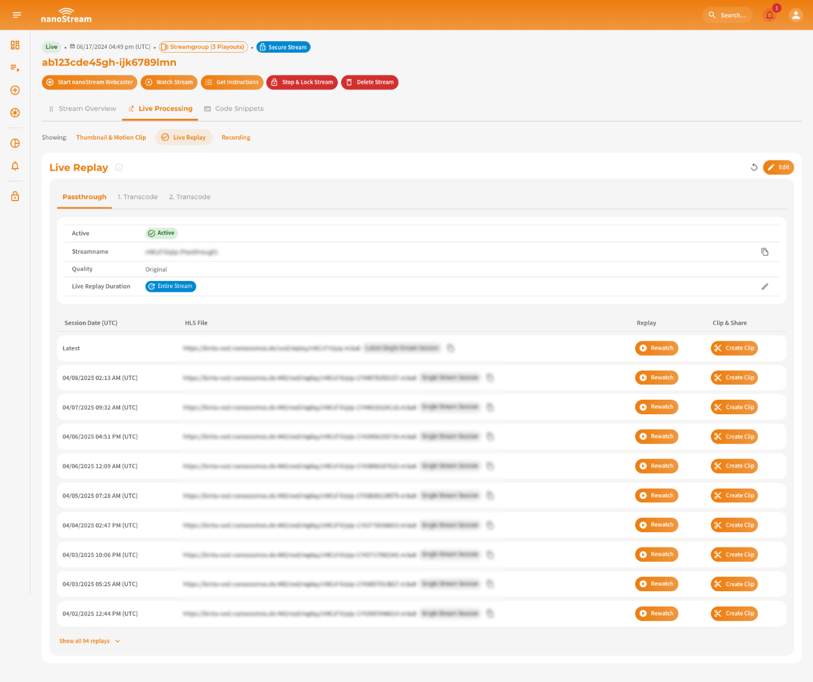
*Screenshot: Live Replay Overview*

#### Recording

The Detail view for the **Recording** live process include:  

- **Process status** (active/inactive)  
- **Streamname**  
- **Asset quality**
- **URL to the asset on our servers**
- **Recording Duration** (in seconds) or whether it applies to the entire stream  

Files are sorted by:  

- **Session Date (UTC)**  
- **File Access**  

:::warning Note
URLs always belong to their respective streams. For **ABR streams**, the URLs are grouped accordingly and listed separately.
:::

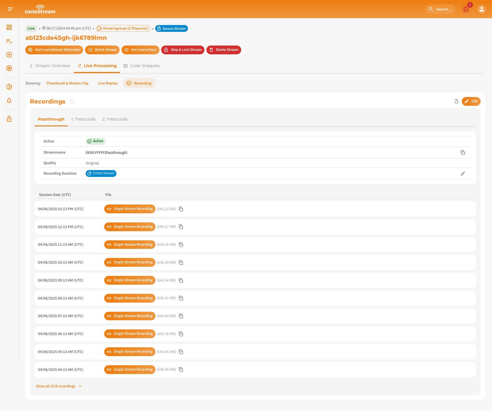
*Screenshot: Recordings Overview*

### Code Snippets

The **Code Snippet** tab provides the necessary details to embed the **nanoStream H5Live Player** effortlessly into your website.  

- **iFrame Code Snippet**
- **HTML Code Snippet**

Using the **Code Snippet Settings** collapsible section, users can modify these snippets. Available settings include:  

- **Start Quality** (for ABR streams)  
- **Latency Control Mode**  

If your organization is part of a `secure` setup, an additional **Token Settings** section is available. Here, users can generate a custom token, which is displayed in a structured format. When sharing the **live playout URL**, this token is automatically applied, ensuring transparency regarding its usage.  

:::tip Learn more about embedding nanoPlayer
👉 Dive into the [Code Snippets page](./code_snippets) for detailed instructions on how to integrate nanoPlayer into your website.
:::

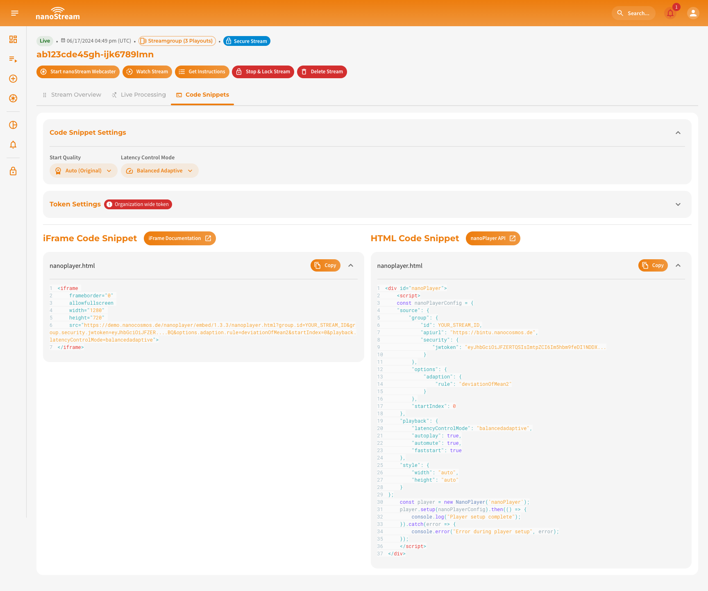
*Screenshot: Code snippets with expanded settings*
