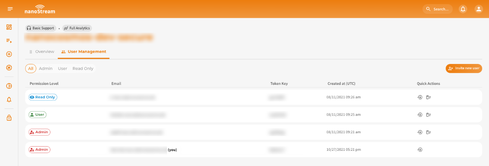
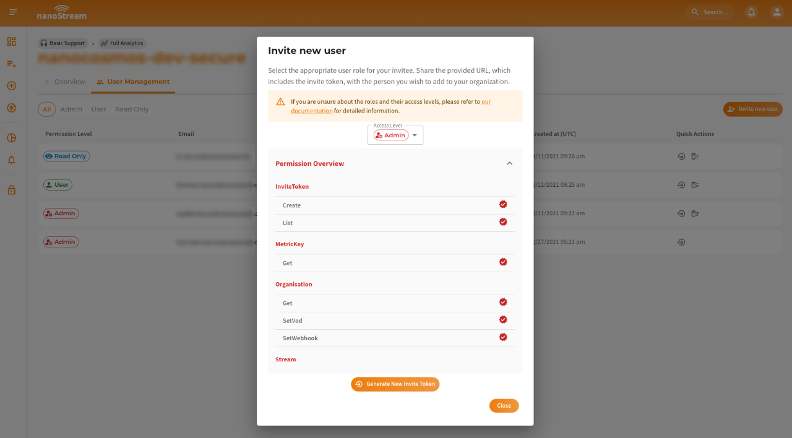
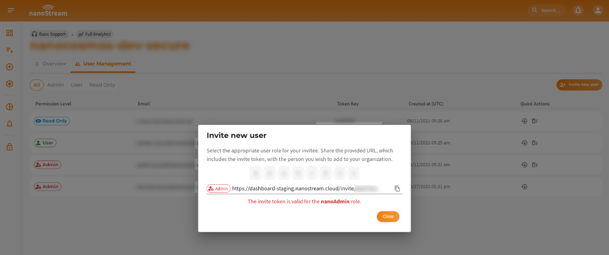
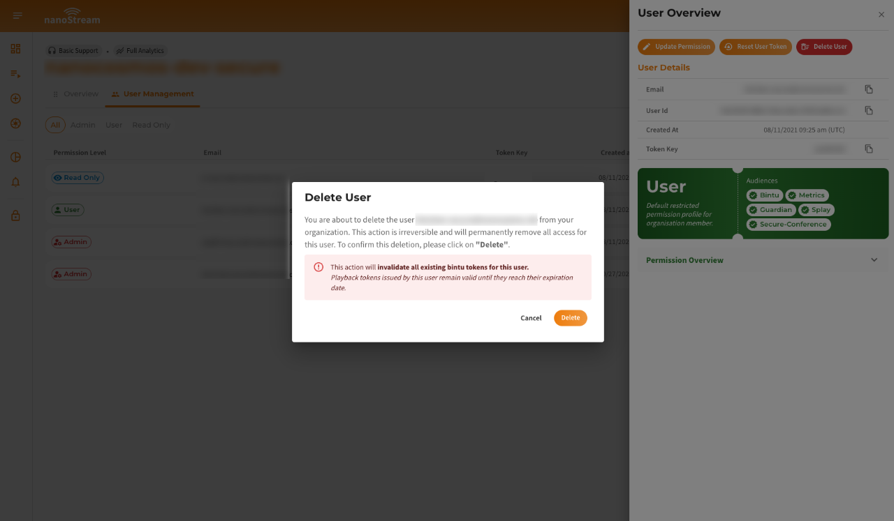

The **User Management** tab of the nanoStream Dashboard allows organization administrators to manage user access and their roles. You can access the **My Organisation** view via the user icon in the top right (desktop) or through the **Account** section in the mobile menu, or by navigating directly to: [dashboard.nanostream.cloud/organisation/users](https://dashboard.nanostream.cloud/organisation/users).

:::info Role-Based Access Control (RBAC)
Role-Based Access Control (RBAC) in **nanoStream** enables efficient management of user roles and permissions, ensuring secure and controlled access to streams.

- [Concept and Benefits](../cloud/user_roles#concept-and-benefits): Understand the advantages of RBAC for security and user management.
- [User Roles](../cloud/user_roles#user-roles-in-nanostream-cloud): Learn about the predefined user roles and their associated responsibilities.
- [High-level Permission Overview](../cloud/user_roles#high-level-permission-overview): Explore the permissions available for each user role and how they control access.

👉 Dive into the technical details in the [User Management](../cloud/user_roles) documentation.
:::

*Screenshot: User Management*

## User List

The **User List** table displays all users associated with your organization.  
You can filter the table by **role**, including both **default roles** provided by nanoStream and any **custom roles** you have defined.

Each user entry includes the following details:

- **Permission Level**
- **Email**
- **Token Key**
- **Created At** (UTC timestamp)
- **Quick actions** (Reset User Token, Delete User)

*Screenshot: Single user row in the userlist*

## Invite New User

To add a new user to your organization, you can generate an **invitation link** via the **Invite New User** button on the [dashboard.nanostream.cloud/organisation/users](https://dashboard.nanostream.cloud/organisation/users) page or the **Invite New User** button in the Profile Menu.

*Screenshot: Invite New User Dialog*

How to invite:

1. Select a **role** for the invitee using the dropdown menu.
2. Review the **permission overview** shown beneath the role selector.
3. Click **Generate New Invite Token**.
4. Share the generated link with the person you want to invite.

The invitation URL contains a token that is valid to join your organisation. The invitee must accept the invitation to join your organization.

*Screenshot: Invite Token Dialog*

## Single User Overview

Clicking on a user allows you to view and manage their individual details and access settings. This includes:

### User Details 
- **Permission Level**
- **Email**
- **User ID**
- **Created At** (UTC timestamp)
- **Token Key**

You’ll also see the user’s **assigned role**, including a description and the associated **audiences** (i.e. scopes or systems the role has access to).
Below that, you can expand the **Permission Overview** panel for a detailed list of what the current role allows.

*Screenshot: User Overview*

### Update Permission

By clicking on the **Update Permission** Button on the top of the **User Overview** its possible to change a user's access level, by following the steps:

1. Select a new role from the dropdown.
2. Review the new role’s permissions.
3. Click **Confirm** to apply the changes.

:::warning Important
Ensure the selected role aligns with the user's responsibilities. Role changes take effect immediately and could restrict or expand the user's access. If you are unsure about the roles and their permissions, please refer to our documentation for guidance.
:::

*Screenshot: Edit User Role Dialog*

### Reset User Token

By clicking on **Reset User Token** a dialog will come up, that invalidates all active **bintu** tokens associated with this user. By clicking on **Confirm** this action will be executed.

:::warning Important
**Playback** tokens issued by this user will remain valid until their expiration date.
:::

*Screenshot: Reset User Token Dialog*

### Delete User

By clicking on **Delete User** a dialog will come up that will let you **Confirm** the deletation of this specific user.

:::danger Important
This action will **invalidate all existing bintu tokens for this user**.
Playback tokens issued by this user remain valid until they reach their expiration date.
:::

*Screenshot: Delete User Dialog*
